# Boston-Moscow Marathon Analysis 

Analyzed the marathon runners’ split finished times to determine top finishers as per the success ratio of the country. This analysis helped to find out the strategies used by top finishers (Positive or Negative split) to complete the marathon effectively

## Project Datasets

Their are two sets of Datasets to complete this project Boston and Moscow Marathon.

### 1. Boston Marathon Results 2017

- **marathon_results_2017.csv**


**Columns** :     {Bib	,Name,	Age,	M/F,	City,	State,	Country,	Citizen,		5K,	10K,	15K,	20K,	Half,	25K,	30K,	35K,	40K,	Pace,	Proj Time,	Official Time,	Overall,	Gender,	Division}

**Data** :        {11,	Kirui, Geoffrey,	24,	M,	Keringet,		KEN,			0:15:25,	0:30:28,	0:45:44,	1:01:15,	1:04:35,	1:16:59,	1:33:01,	1:48:19,	2:02:53,	0:04:57,	-	2:09:37,	1,	1,	1}
     
### 2. Moscow Marathon Full Results 2018

- **1_full_results_mm_2018.csv**

**Columns** :     {Bib,	finish_time_sec,	finish_time_result,	race,	pace_sec,	pace(minpkm),	pace(kmph),	half_pace_sec,	half_pace(minpkm),	half_pace(kmph),	gender_en,	agev	name_en,	location_city_ru,	location_city_en,	country_code_alpha_3,	flag_DNF,	flag_all_split_exist,	race_uniform_index}


**Data** :       {1,	8911,	2h 28min 31sec,	42.195 km,	211.1861595,	3:31 min/km	17.0 km/h,	208.3185212,	3:28 min/km,	17.3 km/h,	Female,	30,	Sardana Trofimova,	–Ø–∫—É—Ç—Å–∫,	Yakutsk,	RUS,	0,	1,	0.000132899}

- **1_split_results_mm_2018.csv**


**Columns** :     {bib,	split_name,	split,	split_time_sec,	split_time_result,	split_pace_sec,	split_pace(minpkm),	split_pace(kmph),	split_uniform_index}


**Data** :        {11,	Kirui, Geoffrey,	24,	M,	Keringet,		KEN,			0:15:25,	0:30:28,	0:45:44,	1:01:15,	1:04:35,	1:16:59,	1:33:01,	1:48:19,	2:02:53,	0:04:57,	-	2:09:37,	1,	1,	11}

## Jupyter Notebook with 3 Interesting findings

```python
%autosave 0
```


    Autosave disabled


```python
# print all the outputs in a cell
from IPython.core.interactiveshell import InteractiveShell
InteractiveShell.ast_node_interactivity = "all"

from datetime import datetime
import numpy as np
import pandas as pd
import seaborn as sns
import pandas as pd
%pylab inline

import sklearn as sk
import sklearn.tree as tree
from IPython.display import Image  
import pydotplus
```

    Populating the interactive namespace from numpy and matplotlib


    /opt/anaconda3/lib/python3.8/site-packages/IPython/core/magics/pylab.py:159: UserWarning: pylab import has clobbered these variables: ['datetime']
    `%matplotlib` prevents importing * from pylab and numpy
      warn("pylab import has clobbered these variables: %s"  % clobbered +


```python
import warnings
#suppress all future warning
warnings.filterwarnings('ignore')
#see only one time warning
#warnings.filterwarnings(action='once')
```

# <u> 1. Data Set Description <u>

<ul>
<li> <b> df_boston </b>is a dataset of all athelets in boston marathon. Each row is represent attribute of an individual athelete. </li>
<li> <b> df_moscow </b>is a dataset of all athelets in Moscow marathon. Each row is represent attribute of an individual athelete. </li>
</ul>

Important columns in <b> df_boston </b> and <b> df_moscow </b> are:
<ol>
<li> BibNo: Unique Number given to each athelet in marathon. </li>
<li> Age: Age of each Athelet. </li>
<li> Gender: Gender of each Athelet. </li>
<li> Country: The Country which each athelet belongs to </li>
<li> Finish_Time: Time taken in seconds by each athelet to complete the race </li>
<li> Final_10k_sec: Time taken in seconds by each athelet to complete 10k distance of the race </li>
<li> Final_Half_sec: Time taken in seconds by each athelet to complete half of the race </li>
<li> Final_40k_sec: Time taken in seconds by each athelet to complete 40k distance of the race </li>
<li> Overall_Ranking: Ranking with respect to Finishing time of each athelet </li>
<li> Gender_Ranking: Ranking with respect to Gender of Athelet. </li>
<li> Division_Ranking: Ranking with repect to Age group of Athelet. </li>
</ol>


```python
df_boston_raw = pd.read_csv('marathon_results_2017.csv')
```


```python
df_moscow_full_results  = pd.read_csv('1_full_results_mm_2018.csv')
```


```python
df_moscow_split_results = pd.read_csv('1_split_results_mm_2018.csv')
```


```python
pd.set_option('display.max_columns',30)
```


```python
df_boston_raw.head()
```


<div>

<table border="1" class="dataframe">
  <thead>
    <tr style="text-align: right;">
      <th></th>
      <th>Unnamed: 0</th>
      <th>Bib</th>
      <th>Name</th>
      <th>Age</th>
      <th>M/F</th>
      <th>City</th>
      <th>State</th>
      <th>Country</th>
      <th>Citizen</th>
      <th>Unnamed: 9</th>
      <th>5K</th>
      <th>10K</th>
      <th>15K</th>
      <th>20K</th>
      <th>Half</th>
      <th>25K</th>
      <th>30K</th>
      <th>35K</th>
      <th>40K</th>
      <th>Pace</th>
      <th>Proj Time</th>
      <th>Official Time</th>
      <th>Overall</th>
      <th>Gender</th>
      <th>Division</th>
    </tr>
  </thead>
  <tbody>
    <tr>
      <th>0</th>
      <td>0</td>
      <td>11</td>
      <td>Kirui, Geoffrey</td>
      <td>24</td>
      <td>M</td>
      <td>Keringet</td>
      <td>NaN</td>
      <td>KEN</td>
      <td>NaN</td>
      <td>NaN</td>
      <td>0:15:25</td>
      <td>0:30:28</td>
      <td>0:45:44</td>
      <td>1:01:15</td>
      <td>1:04:35</td>
      <td>1:16:59</td>
      <td>1:33:01</td>
      <td>1:48:19</td>
      <td>2:02:53</td>
      <td>0:04:57</td>
      <td>-</td>
      <td>2:09:37</td>
      <td>1</td>
      <td>1</td>
      <td>1</td>
    </tr>
    <tr>
      <th>1</th>
      <td>1</td>
      <td>17</td>
      <td>Rupp, Galen</td>
      <td>30</td>
      <td>M</td>
      <td>Portland</td>
      <td>OR</td>
      <td>USA</td>
      <td>NaN</td>
      <td>NaN</td>
      <td>0:15:24</td>
      <td>0:30:27</td>
      <td>0:45:44</td>
      <td>1:01:15</td>
      <td>1:04:35</td>
      <td>1:16:59</td>
      <td>1:33:01</td>
      <td>1:48:19</td>
      <td>2:03:14</td>
      <td>0:04:58</td>
      <td>-</td>
      <td>2:09:58</td>
      <td>2</td>
      <td>2</td>
      <td>2</td>
    </tr>
    <tr>
      <th>2</th>
      <td>2</td>
      <td>23</td>
      <td>Osako, Suguru</td>
      <td>25</td>
      <td>M</td>
      <td>Machida-City</td>
      <td>NaN</td>
      <td>JPN</td>
      <td>NaN</td>
      <td>NaN</td>
      <td>0:15:25</td>
      <td>0:30:29</td>
      <td>0:45:44</td>
      <td>1:01:16</td>
      <td>1:04:36</td>
      <td>1:17:00</td>
      <td>1:33:01</td>
      <td>1:48:31</td>
      <td>2:03:38</td>
      <td>0:04:59</td>
      <td>-</td>
      <td>2:10:28</td>
      <td>3</td>
      <td>3</td>
      <td>3</td>
    </tr>
    <tr>
      <th>3</th>
      <td>3</td>
      <td>21</td>
      <td>Biwott, Shadrack</td>
      <td>32</td>
      <td>M</td>
      <td>Mammoth Lakes</td>
      <td>CA</td>
      <td>USA</td>
      <td>NaN</td>
      <td>NaN</td>
      <td>0:15:25</td>
      <td>0:30:29</td>
      <td>0:45:44</td>
      <td>1:01:19</td>
      <td>1:04:45</td>
      <td>1:17:00</td>
      <td>1:33:01</td>
      <td>1:48:58</td>
      <td>2:04:35</td>
      <td>0:05:03</td>
      <td>-</td>
      <td>2:12:08</td>
      <td>4</td>
      <td>4</td>
      <td>4</td>
    </tr>
    <tr>
      <th>4</th>
      <td>4</td>
      <td>9</td>
      <td>Chebet, Wilson</td>
      <td>31</td>
      <td>M</td>
      <td>Marakwet</td>
      <td>NaN</td>
      <td>KEN</td>
      <td>NaN</td>
      <td>NaN</td>
      <td>0:15:25</td>
      <td>0:30:28</td>
      <td>0:45:44</td>
      <td>1:01:15</td>
      <td>1:04:35</td>
      <td>1:16:59</td>
      <td>1:33:01</td>
      <td>1:48:41</td>
      <td>2:05:00</td>
      <td>0:05:04</td>
      <td>-</td>
      <td>2:12:35</td>
      <td>5</td>
      <td>5</td>
      <td>5</td>
    </tr>
  </tbody>
</table>
</div>


```python
df_moscow_full_results.head()
```


<div>
<table border="1" class="dataframe">
  <thead>
    <tr style="text-align: right;">
      <th></th>
      <th>bib</th>
      <th>finish_time_sec</th>
      <th>finish_time_result</th>
      <th>race</th>
      <th>pace_sec</th>
      <th>pace(minpkm)</th>
      <th>pace(kmph)</th>
      <th>half_pace_sec</th>
      <th>half_pace(minpkm)</th>
      <th>half_pace(kmph)</th>
      <th>gender_en</th>
      <th>age</th>
      <th>name_en</th>
      <th>location_city_ru</th>
      <th>location_city_en</th>
      <th>country_code_alpha_3</th>
      <th>flag_DNF</th>
      <th>flag_all_split_exist</th>
      <th>race_uniform_index</th>
    </tr>
  </thead>
  <tbody>
    <tr>
      <th>0</th>
      <td>1</td>
      <td>8911.0</td>
      <td>2h 28min 31sec</td>
      <td>42.195 km</td>
      <td>211.186160</td>
      <td>3:31 min/km</td>
      <td>17.0 km/h</td>
      <td>208.318521</td>
      <td>3:28 min/km</td>
      <td>17.3 km/h</td>
      <td>Female</td>
      <td>30</td>
      <td>Sardana Trofimova</td>
      <td>Якутск</td>
      <td>Yakutsk</td>
      <td>RUS</td>
      <td>0</td>
      <td>1</td>
      <td>0.000133</td>
    </tr>
    <tr>
      <th>1</th>
      <td>2</td>
      <td>9308.0</td>
      <td>2h 35min 08sec</td>
      <td>42.195 km</td>
      <td>220.594857</td>
      <td>3:40 min/km</td>
      <td>16.3 km/h</td>
      <td>212.157839</td>
      <td>3:32 min/km</td>
      <td>17.0 km/h</td>
      <td>Female</td>
      <td>35</td>
      <td>Tat'yana Arkhipova</td>
      <td>Чебоксары</td>
      <td>Cheboksary</td>
      <td>RUS</td>
      <td>0</td>
      <td>1</td>
      <td>0.002556</td>
    </tr>
    <tr>
      <th>2</th>
      <td>3</td>
      <td>8122.0</td>
      <td>2h 15min 22sec</td>
      <td>42.195 km</td>
      <td>192.487261</td>
      <td>3:12 min/km</td>
      <td>18.7 km/h</td>
      <td>189.880318</td>
      <td>3:09 min/km</td>
      <td>19.0 km/h</td>
      <td>Male</td>
      <td>31</td>
      <td>Stepan Kiselev</td>
      <td>Казань</td>
      <td>Kazan'</td>
      <td>RUS</td>
      <td>0</td>
      <td>1</td>
      <td>0.000397</td>
    </tr>
    <tr>
      <th>3</th>
      <td>4</td>
      <td>8467.0</td>
      <td>2h 21min 07sec</td>
      <td>42.195 km</td>
      <td>200.663586</td>
      <td>3:20 min/km</td>
      <td>17.9 km/h</td>
      <td>186.894182</td>
      <td>3:06 min/km</td>
      <td>19.3 km/h</td>
      <td>Male</td>
      <td>36</td>
      <td>Dmitriy Safronov</td>
      <td>Москва</td>
      <td>Moskva</td>
      <td>RUS</td>
      <td>0</td>
      <td>1</td>
      <td>0.009003</td>
    </tr>
    <tr>
      <th>4</th>
      <td>5</td>
      <td>8738.0</td>
      <td>2h 25min 38sec</td>
      <td>42.195 km</td>
      <td>207.086148</td>
      <td>3:27 min/km</td>
      <td>17.4 km/h</td>
      <td>194.904610</td>
      <td>3:14 min/km</td>
      <td>18.5 km/h</td>
      <td>Male</td>
      <td>42</td>
      <td>Grigoriy Andreev</td>
      <td>Уфа</td>
      <td>Ufa</td>
      <td>RUS</td>
      <td>0</td>
      <td>1</td>
      <td>0.006439</td>
    </tr>
  </tbody>
</table>
</div>


```python
df_boston_raw.shape
```


    (26410, 25)


```python
df_boston_raw.info()
```

    <class 'pandas.core.frame.DataFrame'>
    RangeIndex: 26410 entries, 0 to 26409
    Data columns (total 25 columns):
     #   Column         Non-Null Count  Dtype 
    ---  ------         --------------  ----- 
     0   Unnamed: 0     26410 non-null  int64 
     1   Bib            26410 non-null  object
     2   Name           26410 non-null  object
     3   Age            26410 non-null  int64 
     4   M/F            26410 non-null  object
     5   City           26410 non-null  object
     6   State          22815 non-null  object
     7   Country        26410 non-null  object
     8   Citizen        1254 non-null   object
     9   Unnamed: 9     91 non-null     object
     10  5K             26410 non-null  object
     11  10K            26410 non-null  object
     12  15K            26410 non-null  object
     13  20K            26410 non-null  object
     14  Half           26410 non-null  object
     15  25K            26410 non-null  object
     16  30K            26410 non-null  object
     17  35K            26410 non-null  object
     18  40K            26410 non-null  object
     19  Pace           26410 non-null  object
     20  Proj Time      26410 non-null  object
     21  Official Time  26410 non-null  object
     22  Overall        26410 non-null  int64 
     23  Gender         26410 non-null  int64 
     24  Division       26410 non-null  int64 
    dtypes: int64(5), object(20)
    memory usage: 5.0+ MB


```python
df_boston_raw.isna().sum()
```


    Unnamed: 0           0
    Bib                  0
    Name                 0
    Age                  0
    M/F                  0
    City                 0
    State             3595
    Country              0
    Citizen          25156
    Unnamed: 9       26319
    5K                   0
    10K                  0
    15K                  0
    20K                  0
    Half                 0
    25K                  0
    30K                  0
    35K                  0
    40K                  0
    Pace                 0
    Proj Time            0
    Official Time        0
    Overall              0
    Gender               0
    Division             0
    dtype: int64


```python
df_moscow_full_results.shape
```


    (21662, 19)


```python
df_moscow_split_results.shape
```


    (104438, 9)


```python
df_moscow_full_results.info()
```

    <class 'pandas.core.frame.DataFrame'>
    RangeIndex: 21662 entries, 0 to 21661
    Data columns (total 19 columns):
     #   Column                Non-Null Count  Dtype  
    ---  ------                --------------  -----  
     0   bib                   21662 non-null  int64  
     1   finish_time_sec       21385 non-null  float64
     2   finish_time_result    21385 non-null  object 
     3   race                  21662 non-null  object 
     4   pace_sec              21385 non-null  float64
     5   pace(minpkm)          21385 non-null  object 
     6   pace(kmph)            21385 non-null  object 
     7   half_pace_sec         21380 non-null  float64
     8   half_pace(minpkm)     21380 non-null  object 
     9   half_pace(kmph)       21385 non-null  object 
     10  gender_en             21662 non-null  object 
     11  age                   21662 non-null  int64  
     12  name_en               21662 non-null  object 
     13  location_city_ru      21662 non-null  object 
     14  location_city_en      21662 non-null  object 
     15  country_code_alpha_3  21662 non-null  object 
     16  flag_DNF              21662 non-null  int64  
     17  flag_all_split_exist  21662 non-null  int64  
     18  race_uniform_index    21289 non-null  float64
    dtypes: float64(4), int64(4), object(11)
    memory usage: 3.1+ MB


```python
df_moscow_full_results.isna().sum()
```


    bib                       0
    finish_time_sec         277
    finish_time_result      277
    race                      0
    pace_sec                277
    pace(minpkm)            277
    pace(kmph)              277
    half_pace_sec           282
    half_pace(minpkm)       282
    half_pace(kmph)         277
    gender_en                 0
    age                       0
    name_en                   0
    location_city_ru          0
    location_city_en          0
    country_code_alpha_3      0
    flag_DNF                  0
    flag_all_split_exist      0
    race_uniform_index      373
    dtype: int64


#### Drop the unused columns and standardised the column names by renaming as per the both datasets in Boston Dataframe


```python
df_boston_raw.drop(columns=['Unnamed: 0','Citizen','Unnamed: 9','Proj Time'],axis=1,inplace=True)
```


```python
df_boston_raw.rename(columns={'Bib':'BibNo','M/F':'Gender','Pace':'Pace_minpermile','Official Time':'Finish_Time',\
                   'Overall':'Overall_ranking','Gender':'Gender_ranking','Division':'Division_ranking'},inplace=True)
```

#### Replaced Male and Female with values 0 and 1 in Boston Dataframe


```python
df_boston_raw.replace(to_replace='M', value=1.0, inplace=True)
```


```python
df_boston_raw.replace(to_replace='F', value=0.0, inplace=True)
```


```python
df_boston_raw.head()
```


<div>
<table border="1" class="dataframe">
  <thead>
    <tr style="text-align: right;">
      <th></th>
      <th>BibNo</th>
      <th>Name</th>
      <th>Age</th>
      <th>Gender</th>
      <th>City</th>
      <th>State</th>
      <th>Country</th>
      <th>5K</th>
      <th>10K</th>
      <th>15K</th>
      <th>20K</th>
      <th>Half</th>
      <th>25K</th>
      <th>30K</th>
      <th>35K</th>
      <th>40K</th>
      <th>Pace_minpermile</th>
      <th>Finish_Time</th>
      <th>Overall_ranking</th>
      <th>Gender_ranking</th>
      <th>Division_ranking</th>
    </tr>
  </thead>
  <tbody>
    <tr>
      <th>0</th>
      <td>11</td>
      <td>Kirui, Geoffrey</td>
      <td>24</td>
      <td>1.0</td>
      <td>Keringet</td>
      <td>NaN</td>
      <td>KEN</td>
      <td>0:15:25</td>
      <td>0:30:28</td>
      <td>0:45:44</td>
      <td>1:01:15</td>
      <td>1:04:35</td>
      <td>1:16:59</td>
      <td>1:33:01</td>
      <td>1:48:19</td>
      <td>2:02:53</td>
      <td>0:04:57</td>
      <td>2:09:37</td>
      <td>1</td>
      <td>1</td>
      <td>1</td>
    </tr>
    <tr>
      <th>1</th>
      <td>17</td>
      <td>Rupp, Galen</td>
      <td>30</td>
      <td>1.0</td>
      <td>Portland</td>
      <td>OR</td>
      <td>USA</td>
      <td>0:15:24</td>
      <td>0:30:27</td>
      <td>0:45:44</td>
      <td>1:01:15</td>
      <td>1:04:35</td>
      <td>1:16:59</td>
      <td>1:33:01</td>
      <td>1:48:19</td>
      <td>2:03:14</td>
      <td>0:04:58</td>
      <td>2:09:58</td>
      <td>2</td>
      <td>2</td>
      <td>2</td>
    </tr>
    <tr>
      <th>2</th>
      <td>23</td>
      <td>Osako, Suguru</td>
      <td>25</td>
      <td>1.0</td>
      <td>Machida-City</td>
      <td>NaN</td>
      <td>JPN</td>
      <td>0:15:25</td>
      <td>0:30:29</td>
      <td>0:45:44</td>
      <td>1:01:16</td>
      <td>1:04:36</td>
      <td>1:17:00</td>
      <td>1:33:01</td>
      <td>1:48:31</td>
      <td>2:03:38</td>
      <td>0:04:59</td>
      <td>2:10:28</td>
      <td>3</td>
      <td>3</td>
      <td>3</td>
    </tr>
    <tr>
      <th>3</th>
      <td>21</td>
      <td>Biwott, Shadrack</td>
      <td>32</td>
      <td>1.0</td>
      <td>Mammoth Lakes</td>
      <td>CA</td>
      <td>USA</td>
      <td>0:15:25</td>
      <td>0:30:29</td>
      <td>0:45:44</td>
      <td>1:01:19</td>
      <td>1:04:45</td>
      <td>1:17:00</td>
      <td>1:33:01</td>
      <td>1:48:58</td>
      <td>2:04:35</td>
      <td>0:05:03</td>
      <td>2:12:08</td>
      <td>4</td>
      <td>4</td>
      <td>4</td>
    </tr>
    <tr>
      <th>4</th>
      <td>9</td>
      <td>Chebet, Wilson</td>
      <td>31</td>
      <td>1.0</td>
      <td>Marakwet</td>
      <td>NaN</td>
      <td>KEN</td>
      <td>0:15:25</td>
      <td>0:30:28</td>
      <td>0:45:44</td>
      <td>1:01:15</td>
      <td>1:04:35</td>
      <td>1:16:59</td>
      <td>1:33:01</td>
      <td>1:48:41</td>
      <td>2:05:00</td>
      <td>0:05:04</td>
      <td>2:12:35</td>
      <td>5</td>
      <td>5</td>
      <td>5</td>
    </tr>
  </tbody>
</table>
</div>


#### Drop the unused columns and standardised the column names by renaming as per the both datasets in Moscow Dataframe


```python
df_moscow_full_results.drop(['finish_time_result','location_city_ru','flag_all_split_exist',\
                      'race','pace(kmph)','half_pace(kmph)','location_city_ru','flag_DNF',\
                      'flag_all_split_exist','race_uniform_index'],axis=1,inplace=True)
```


```python
df_moscow_full_results.rename(columns ={'bib':'BibNo','pace_sec':'Pace_Sec','finish_time_sec':'Finish_Time_Sec',\
                    'pace(minpkm)':'Pace_Minpkm','half_pace_sec':'Half_Pace_Sec',\
                    'half_pace(minpkm)':'Half_Pace_Minpkm','gender_en':'Gender',\
                    'age':'Age','name_en':'Name','location_city_en':'City','country_code_alpha_3':'Country'},inplace=True)
```


```python
df_moscow_split_results.drop(['split_pace(minpkm)','split_pace(kmph)','split_uniform_index','split'],axis=1,inplace=True)
```


```python
df_moscow_split_results.head()
```


<div>
<table border="1" class="dataframe">
  <thead>
    <tr style="text-align: right;">
      <th></th>
      <th>bib</th>
      <th>split_name</th>
      <th>split_time_sec</th>
      <th>split_time_result</th>
      <th>split_pace_sec</th>
    </tr>
  </thead>
  <tbody>
    <tr>
      <th>0</th>
      <td>1</td>
      <td>5 km</td>
      <td>1057</td>
      <td>17min 37sec</td>
      <td>211.400000</td>
    </tr>
    <tr>
      <th>1</th>
      <td>1</td>
      <td>10 km</td>
      <td>2112</td>
      <td>35min 12sec</td>
      <td>211.000000</td>
    </tr>
    <tr>
      <th>2</th>
      <td>1</td>
      <td>15 km</td>
      <td>3149</td>
      <td>52min 29sec</td>
      <td>207.400000</td>
    </tr>
    <tr>
      <th>3</th>
      <td>1</td>
      <td>Half marathon</td>
      <td>4395</td>
      <td>1h 13min 15sec</td>
      <td>204.346043</td>
    </tr>
    <tr>
      <th>4</th>
      <td>1</td>
      <td>25 km</td>
      <td>5258</td>
      <td>1h 27min 38sec</td>
      <td>221.140295</td>
    </tr>
  </tbody>
</table>
</div>


```python
df_moscow_split_results.rename (columns={'bib':'BibNo','split_name':'Split_Name','split_time_sec':'Split_Time_Sec',\
                    'split_time_result':'Split_Time_Result','split_pace_sec':'Split_Pace_Sec'},inplace=True)
```

#### By using pivot table to make split_name values as column in Moscow_Split_Results and Moscow_Full_Results Dataframe


```python
df_moscow_split_results['Marathon_Split'] = ((df_moscow_split_results.Split_Name == ('10 km'))\
                                             |(df_moscow_split_results.Split_Name == ('Half marathon'))\
                                             |(df_moscow_split_results.Split_Name == ('Marathon')))
```


```python
df_temp_pivot = df_moscow_split_results.pivot_table(index='BibNo', columns='Split_Name', values='Split_Time_Sec')
```


```python
df_temp_pivot.head()
```


<div>
<table border="1" class="dataframe">
  <thead>
    <tr style="text-align: right;">
      <th>Split_Name</th>
      <th>10 km</th>
      <th>15 km</th>
      <th>25 km</th>
      <th>30 km</th>
      <th>35 km</th>
      <th>40 km</th>
      <th>5 km</th>
      <th>Half marathon</th>
      <th>Marathon</th>
    </tr>
    <tr>
      <th>BibNo</th>
      <th></th>
      <th></th>
      <th></th>
      <th></th>
      <th></th>
      <th></th>
      <th></th>
      <th></th>
      <th></th>
    </tr>
  </thead>
  <tbody>
    <tr>
      <th>1</th>
      <td>2112.0</td>
      <td>3149.0</td>
      <td>5258.0</td>
      <td>6321.0</td>
      <td>7362.0</td>
      <td>8442.0</td>
      <td>1057.0</td>
      <td>4395.0</td>
      <td>8911.0</td>
    </tr>
    <tr>
      <th>2</th>
      <td>2115.0</td>
      <td>3188.0</td>
      <td>5386.0</td>
      <td>6508.0</td>
      <td>7608.0</td>
      <td>8784.0</td>
      <td>1059.0</td>
      <td>4476.0</td>
      <td>9308.0</td>
    </tr>
    <tr>
      <th>3</th>
      <td>1899.0</td>
      <td>2867.0</td>
      <td>4796.0</td>
      <td>5786.0</td>
      <td>6632.0</td>
      <td>7703.0</td>
      <td>947.0</td>
      <td>4006.0</td>
      <td>8122.0</td>
    </tr>
    <tr>
      <th>4</th>
      <td>1876.0</td>
      <td>2814.0</td>
      <td>4752.0</td>
      <td>5780.0</td>
      <td>6827.0</td>
      <td>7967.0</td>
      <td>945.0</td>
      <td>3943.0</td>
      <td>8467.0</td>
    </tr>
    <tr>
      <th>5</th>
      <td>1958.0</td>
      <td>2933.0</td>
      <td>4949.0</td>
      <td>6015.0</td>
      <td>7080.0</td>
      <td>8235.0</td>
      <td>976.0</td>
      <td>4112.0</td>
      <td>8738.0</td>
    </tr>
  </tbody>
</table>
</div>


```python
df_temp_pivot.drop(['15 km','25 km','30 km','35 km','40 km','5 km'],axis=1,inplace=True)
```


```python
df_temp_pivot.set_index='BibNo'
```

#### Used the Outer Merge on Pivot table and Moscow_Full_Result to to get the split name values as column in Moscow_full_result


```python
df_Moscow = df_moscow_full_results.merge(df_temp_pivot,how='outer',right_index=True,left_on='BibNo')
```


```python
df_Moscow = df_moscow_full_results.merge(df_temp_pivot,how='outer',right_index=True,left_on='BibNo')
```


```python
df_Moscow.head()
```


<div>
<table border="1" class="dataframe">
  <thead>
    <tr style="text-align: right;">
      <th></th>
      <th>BibNo</th>
      <th>Finish_Time_Sec</th>
      <th>Pace_Sec</th>
      <th>Pace_Minpkm</th>
      <th>Half_Pace_Sec</th>
      <th>Half_Pace_Minpkm</th>
      <th>Gender</th>
      <th>Age</th>
      <th>Name</th>
      <th>City</th>
      <th>Country</th>
      <th>10 km</th>
      <th>Half marathon</th>
      <th>Marathon</th>
    </tr>
  </thead>
  <tbody>
    <tr>
      <th>0</th>
      <td>1</td>
      <td>8911.0</td>
      <td>211.186160</td>
      <td>3:31 min/km</td>
      <td>208.318521</td>
      <td>3:28 min/km</td>
      <td>Female</td>
      <td>30</td>
      <td>Sardana Trofimova</td>
      <td>Yakutsk</td>
      <td>RUS</td>
      <td>2112.0</td>
      <td>4395.0</td>
      <td>8911.0</td>
    </tr>
    <tr>
      <th>1</th>
      <td>2</td>
      <td>9308.0</td>
      <td>220.594857</td>
      <td>3:40 min/km</td>
      <td>212.157839</td>
      <td>3:32 min/km</td>
      <td>Female</td>
      <td>35</td>
      <td>Tat'yana Arkhipova</td>
      <td>Cheboksary</td>
      <td>RUS</td>
      <td>2115.0</td>
      <td>4476.0</td>
      <td>9308.0</td>
    </tr>
    <tr>
      <th>2</th>
      <td>3</td>
      <td>8122.0</td>
      <td>192.487261</td>
      <td>3:12 min/km</td>
      <td>189.880318</td>
      <td>3:09 min/km</td>
      <td>Male</td>
      <td>31</td>
      <td>Stepan Kiselev</td>
      <td>Kazan'</td>
      <td>RUS</td>
      <td>1899.0</td>
      <td>4006.0</td>
      <td>8122.0</td>
    </tr>
    <tr>
      <th>3</th>
      <td>4</td>
      <td>8467.0</td>
      <td>200.663586</td>
      <td>3:20 min/km</td>
      <td>186.894182</td>
      <td>3:06 min/km</td>
      <td>Male</td>
      <td>36</td>
      <td>Dmitriy Safronov</td>
      <td>Moskva</td>
      <td>RUS</td>
      <td>1876.0</td>
      <td>3943.0</td>
      <td>8467.0</td>
    </tr>
    <tr>
      <th>4</th>
      <td>5</td>
      <td>8738.0</td>
      <td>207.086148</td>
      <td>3:27 min/km</td>
      <td>194.904610</td>
      <td>3:14 min/km</td>
      <td>Male</td>
      <td>42</td>
      <td>Grigoriy Andreev</td>
      <td>Ufa</td>
      <td>RUS</td>
      <td>1958.0</td>
      <td>4112.0</td>
      <td>8738.0</td>
    </tr>
  </tbody>
</table>
</div>


#### Sorted the values based on Finish time seconds for overall ranking of athletes in Moscow dataframe


```python
df_Moscow.sort_values(by='Finish_Time_Sec')
```


<div>
<table border="1" class="dataframe">
  <thead>
    <tr style="text-align: right;">
      <th></th>
      <th>BibNo</th>
      <th>Finish_Time_Sec</th>
      <th>Pace_Sec</th>
      <th>Pace_Minpkm</th>
      <th>Half_Pace_Sec</th>
      <th>Half_Pace_Minpkm</th>
      <th>Gender</th>
      <th>Age</th>
      <th>Name</th>
      <th>City</th>
      <th>Country</th>
      <th>10 km</th>
      <th>Half marathon</th>
      <th>Marathon</th>
    </tr>
  </thead>
  <tbody>
    <tr>
      <th>8982</th>
      <td>17006</td>
      <td>1728.0</td>
      <td>172.8</td>
      <td>2:52 min/km</td>
      <td>175.8</td>
      <td>2:55 min/km</td>
      <td>Male</td>
      <td>26</td>
      <td>Vladimir Nikitin</td>
      <td>Perm'</td>
      <td>RUS</td>
      <td>1728.0</td>
      <td>NaN</td>
      <td>NaN</td>
    </tr>
    <tr>
      <th>8991</th>
      <td>17018</td>
      <td>1826.0</td>
      <td>182.6</td>
      <td>3:02 min/km</td>
      <td>183.6</td>
      <td>3:03 min/km</td>
      <td>Male</td>
      <td>29</td>
      <td>Denis Vasil'ev</td>
      <td>Sankt-Peterburg</td>
      <td>RUS</td>
      <td>1826.0</td>
      <td>NaN</td>
      <td>NaN</td>
    </tr>
    <tr>
      <th>21362</th>
      <td>32745</td>
      <td>1834.0</td>
      <td>183.4</td>
      <td>3:03 min/km</td>
      <td>185.6</td>
      <td>3:05 min/km</td>
      <td>Male</td>
      <td>30</td>
      <td>Artur Burtsev</td>
      <td>Sankt-Peterburg</td>
      <td>RUS</td>
      <td>1834.0</td>
      <td>NaN</td>
      <td>NaN</td>
    </tr>
    <tr>
      <th>8988</th>
      <td>17013</td>
      <td>1869.0</td>
      <td>186.9</td>
      <td>3:06 min/km</td>
      <td>186.6</td>
      <td>3:06 min/km</td>
      <td>Male</td>
      <td>24</td>
      <td>Ivan Panferov</td>
      <td>Moskva</td>
      <td>RUS</td>
      <td>1869.0</td>
      <td>NaN</td>
      <td>NaN</td>
    </tr>
    <tr>
      <th>21114</th>
      <td>32472</td>
      <td>1869.0</td>
      <td>186.9</td>
      <td>3:06 min/km</td>
      <td>188.2</td>
      <td>3:08 min/km</td>
      <td>Male</td>
      <td>22</td>
      <td>Nikita Kotenev</td>
      <td>Minsk</td>
      <td>BLR</td>
      <td>1869.0</td>
      <td>NaN</td>
      <td>NaN</td>
    </tr>
    <tr>
      <th>...</th>
      <td>...</td>
      <td>...</td>
      <td>...</td>
      <td>...</td>
      <td>...</td>
      <td>...</td>
      <td>...</td>
      <td>...</td>
      <td>...</td>
      <td>...</td>
      <td>...</td>
      <td>...</td>
      <td>...</td>
      <td>...</td>
    </tr>
    <tr>
      <th>8954</th>
      <td>11201</td>
      <td>NaN</td>
      <td>NaN</td>
      <td>NaN</td>
      <td>NaN</td>
      <td>NaN</td>
      <td>Male</td>
      <td>30</td>
      <td>Murtuz Ramazanov</td>
      <td>Moskva</td>
      <td>RUS</td>
      <td>4493.0</td>
      <td>10282.0</td>
      <td>NaN</td>
    </tr>
    <tr>
      <th>8960</th>
      <td>11209</td>
      <td>NaN</td>
      <td>NaN</td>
      <td>NaN</td>
      <td>NaN</td>
      <td>NaN</td>
      <td>Female</td>
      <td>37</td>
      <td>Ekaterina Andreeva</td>
      <td>Moskva</td>
      <td>RUS</td>
      <td>NaN</td>
      <td>NaN</td>
      <td>NaN</td>
    </tr>
    <tr>
      <th>8961</th>
      <td>11210</td>
      <td>NaN</td>
      <td>NaN</td>
      <td>NaN</td>
      <td>NaN</td>
      <td>NaN</td>
      <td>Male</td>
      <td>28</td>
      <td>Sergey Nikitin</td>
      <td>Moskva</td>
      <td>RUS</td>
      <td>NaN</td>
      <td>NaN</td>
      <td>NaN</td>
    </tr>
    <tr>
      <th>8973</th>
      <td>15013</td>
      <td>NaN</td>
      <td>NaN</td>
      <td>NaN</td>
      <td>NaN</td>
      <td>NaN</td>
      <td>Male</td>
      <td>32</td>
      <td>Mikhail Maksimov</td>
      <td>Sankt-Peterburg</td>
      <td>RUS</td>
      <td>1957.0</td>
      <td>4086.0</td>
      <td>NaN</td>
    </tr>
    <tr>
      <th>16208</th>
      <td>26352</td>
      <td>NaN</td>
      <td>NaN</td>
      <td>NaN</td>
      <td>NaN</td>
      <td>NaN</td>
      <td>Female</td>
      <td>29</td>
      <td>Lyudmila Tret'yakova</td>
      <td>Moskva</td>
      <td>RUS</td>
      <td>NaN</td>
      <td>NaN</td>
      <td>NaN</td>
    </tr>
  </tbody>
</table>
<p>21662 rows × 14 columns</p>
</div>


```python
df_Moscow['Marathon'].isna().sum()
```


    12960


#### Drop the NAN values Moscow Dataframe from Marathon column which shows that person has not completed the marathon 


```python
df_Moscow.dropna(how='any',subset=['Marathon'],inplace=True)
```


```python
df_new_Moscow= df_Moscow.sort_values(by='Finish_Time_Sec')
```


```python
df_new_Moscow.head()
```


<div>
<table border="1" class="dataframe">
  <thead>
    <tr style="text-align: right;">
      <th></th>
      <th>BibNo</th>
      <th>Finish_Time_Sec</th>
      <th>Pace_Sec</th>
      <th>Pace_Minpkm</th>
      <th>Half_Pace_Sec</th>
      <th>Half_Pace_Minpkm</th>
      <th>Gender</th>
      <th>Age</th>
      <th>Name</th>
      <th>City</th>
      <th>Country</th>
      <th>10 km</th>
      <th>Half marathon</th>
      <th>Marathon</th>
    </tr>
  </thead>
  <tbody>
    <tr>
      <th>2</th>
      <td>3</td>
      <td>8122.0</td>
      <td>192.487261</td>
      <td>3:12 min/km</td>
      <td>189.880318</td>
      <td>3:09 min/km</td>
      <td>Male</td>
      <td>31</td>
      <td>Stepan Kiselev</td>
      <td>Kazan'</td>
      <td>RUS</td>
      <td>1899.0</td>
      <td>4006.0</td>
      <td>8122.0</td>
    </tr>
    <tr>
      <th>10</th>
      <td>12</td>
      <td>8161.0</td>
      <td>193.411542</td>
      <td>3:13 min/km</td>
      <td>189.738121</td>
      <td>3:09 min/km</td>
      <td>Male</td>
      <td>32</td>
      <td>Aleksey Troshkin</td>
      <td>Saransk</td>
      <td>RUS</td>
      <td>1905.0</td>
      <td>4003.0</td>
      <td>8161.0</td>
    </tr>
    <tr>
      <th>8</th>
      <td>10</td>
      <td>8394.0</td>
      <td>198.933523</td>
      <td>3:18 min/km</td>
      <td>188.268752</td>
      <td>3:08 min/km</td>
      <td>Male</td>
      <td>27</td>
      <td>Artem Aplachkin</td>
      <td>Barnaul</td>
      <td>RUS</td>
      <td>1879.0</td>
      <td>3972.0</td>
      <td>8394.0</td>
    </tr>
    <tr>
      <th>8968</th>
      <td>15008</td>
      <td>8416.0</td>
      <td>199.454912</td>
      <td>3:19 min/km</td>
      <td>195.094205</td>
      <td>3:15 min/km</td>
      <td>Male</td>
      <td>29</td>
      <td>Sergey Popov</td>
      <td>Voronezh</td>
      <td>RUS</td>
      <td>1960.0</td>
      <td>4116.0</td>
      <td>8416.0</td>
    </tr>
    <tr>
      <th>3</th>
      <td>4</td>
      <td>8467.0</td>
      <td>200.663586</td>
      <td>3:20 min/km</td>
      <td>186.894182</td>
      <td>3:06 min/km</td>
      <td>Male</td>
      <td>36</td>
      <td>Dmitriy Safronov</td>
      <td>Moskva</td>
      <td>RUS</td>
      <td>1876.0</td>
      <td>3943.0</td>
      <td>8467.0</td>
    </tr>
  </tbody>
</table>
</div>


#### Added the new column overall ranking calculated based on Finish time seconds in Moscow dataframe


```python
df_new_Moscow = df_new_Moscow.reset_index()
df_new_Moscow['Overall_Ranking'] = df_new_Moscow.index + 1
```


```python
df_new_Moscow
```


<div>
<table border="1" class="dataframe">
  <thead>
    <tr style="text-align: right;">
      <th></th>
      <th>index</th>
      <th>BibNo</th>
      <th>Finish_Time_Sec</th>
      <th>Pace_Sec</th>
      <th>Pace_Minpkm</th>
      <th>Half_Pace_Sec</th>
      <th>Half_Pace_Minpkm</th>
      <th>Gender</th>
      <th>Age</th>
      <th>Name</th>
      <th>City</th>
      <th>Country</th>
      <th>10 km</th>
      <th>Half marathon</th>
      <th>Marathon</th>
      <th>Overall_Ranking</th>
    </tr>
  </thead>
  <tbody>
    <tr>
      <th>0</th>
      <td>2</td>
      <td>3</td>
      <td>8122.0</td>
      <td>192.487261</td>
      <td>3:12 min/km</td>
      <td>189.880318</td>
      <td>3:09 min/km</td>
      <td>Male</td>
      <td>31</td>
      <td>Stepan Kiselev</td>
      <td>Kazan'</td>
      <td>RUS</td>
      <td>1899.0</td>
      <td>4006.0</td>
      <td>8122.0</td>
      <td>1</td>
    </tr>
    <tr>
      <th>1</th>
      <td>10</td>
      <td>12</td>
      <td>8161.0</td>
      <td>193.411542</td>
      <td>3:13 min/km</td>
      <td>189.738121</td>
      <td>3:09 min/km</td>
      <td>Male</td>
      <td>32</td>
      <td>Aleksey Troshkin</td>
      <td>Saransk</td>
      <td>RUS</td>
      <td>1905.0</td>
      <td>4003.0</td>
      <td>8161.0</td>
      <td>2</td>
    </tr>
    <tr>
      <th>2</th>
      <td>8</td>
      <td>10</td>
      <td>8394.0</td>
      <td>198.933523</td>
      <td>3:18 min/km</td>
      <td>188.268752</td>
      <td>3:08 min/km</td>
      <td>Male</td>
      <td>27</td>
      <td>Artem Aplachkin</td>
      <td>Barnaul</td>
      <td>RUS</td>
      <td>1879.0</td>
      <td>3972.0</td>
      <td>8394.0</td>
      <td>3</td>
    </tr>
    <tr>
      <th>3</th>
      <td>8968</td>
      <td>15008</td>
      <td>8416.0</td>
      <td>199.454912</td>
      <td>3:19 min/km</td>
      <td>195.094205</td>
      <td>3:15 min/km</td>
      <td>Male</td>
      <td>29</td>
      <td>Sergey Popov</td>
      <td>Voronezh</td>
      <td>RUS</td>
      <td>1960.0</td>
      <td>4116.0</td>
      <td>8416.0</td>
      <td>4</td>
    </tr>
    <tr>
      <th>4</th>
      <td>3</td>
      <td>4</td>
      <td>8467.0</td>
      <td>200.663586</td>
      <td>3:20 min/km</td>
      <td>186.894182</td>
      <td>3:06 min/km</td>
      <td>Male</td>
      <td>36</td>
      <td>Dmitriy Safronov</td>
      <td>Moskva</td>
      <td>RUS</td>
      <td>1876.0</td>
      <td>3943.0</td>
      <td>8467.0</td>
      <td>5</td>
    </tr>
    <tr>
      <th>...</th>
      <td>...</td>
      <td>...</td>
      <td>...</td>
      <td>...</td>
      <td>...</td>
      <td>...</td>
      <td>...</td>
      <td>...</td>
      <td>...</td>
      <td>...</td>
      <td>...</td>
      <td>...</td>
      <td>...</td>
      <td>...</td>
      <td>...</td>
      <td>...</td>
    </tr>
    <tr>
      <th>8697</th>
      <td>1297</td>
      <td>1818</td>
      <td>22102.0</td>
      <td>523.806138</td>
      <td>8:43 min/km</td>
      <td>492.617609</td>
      <td>8:12 min/km</td>
      <td>Male</td>
      <td>64</td>
      <td>Songkran Amornsaengthong</td>
      <td>Moskva</td>
      <td>RUS</td>
      <td>4984.0</td>
      <td>10393.0</td>
      <td>22102.0</td>
      <td>8698</td>
    </tr>
    <tr>
      <th>8698</th>
      <td>8578</td>
      <td>10770</td>
      <td>22178.0</td>
      <td>525.607299</td>
      <td>8:45 min/km</td>
      <td>559.450172</td>
      <td>9:19 min/km</td>
      <td>Male</td>
      <td>36</td>
      <td>Aleksey Popov</td>
      <td>Moskva</td>
      <td>RUS</td>
      <td>5956.0</td>
      <td>11803.0</td>
      <td>22178.0</td>
      <td>8699</td>
    </tr>
    <tr>
      <th>8699</th>
      <td>3199</td>
      <td>4301</td>
      <td>22183.0</td>
      <td>525.725797</td>
      <td>8:45 min/km</td>
      <td>503.471975</td>
      <td>8:23 min/km</td>
      <td>Male</td>
      <td>26</td>
      <td>Danila Malykhin</td>
      <td>Moskva</td>
      <td>RUS</td>
      <td>4862.0</td>
      <td>10622.0</td>
      <td>22183.0</td>
      <td>8700</td>
    </tr>
    <tr>
      <th>8700</th>
      <td>6340</td>
      <td>8204</td>
      <td>22291.0</td>
      <td>528.285342</td>
      <td>8:48 min/km</td>
      <td>383.315559</td>
      <td>6:23 min/km</td>
      <td>Male</td>
      <td>63</td>
      <td>Chi_Wan Yu</td>
      <td>Hong Kong</td>
      <td>HKG</td>
      <td>3704.0</td>
      <td>8087.0</td>
      <td>22291.0</td>
      <td>8701</td>
    </tr>
    <tr>
      <th>8701</th>
      <td>2526</td>
      <td>3462</td>
      <td>22672.0</td>
      <td>537.314848</td>
      <td>8:57 min/km</td>
      <td>493.518189</td>
      <td>8:13 min/km</td>
      <td>Male</td>
      <td>25</td>
      <td>Artem Prasolov</td>
      <td>Moskva</td>
      <td>RUS</td>
      <td>4607.0</td>
      <td>10412.0</td>
      <td>22672.0</td>
      <td>8702</td>
    </tr>
  </tbody>
</table>
<p>8702 rows × 16 columns</p>
</div>


```python
df_new_Moscow.info()
```

    <class 'pandas.core.frame.DataFrame'>
    RangeIndex: 8702 entries, 0 to 8701
    Data columns (total 16 columns):
     #   Column            Non-Null Count  Dtype  
    ---  ------            --------------  -----  
     0   index             8702 non-null   int64  
     1   BibNo             8702 non-null   int64  
     2   Finish_Time_Sec   8702 non-null   float64
     3   Pace_Sec          8702 non-null   float64
     4   Pace_Minpkm       8702 non-null   object 
     5   Half_Pace_Sec     8702 non-null   float64
     6   Half_Pace_Minpkm  8702 non-null   object 
     7   Gender            8702 non-null   object 
     8   Age               8702 non-null   int64  
     9   Name              8702 non-null   object 
     10  City              8702 non-null   object 
     11  Country           8702 non-null   object 
     12  10 km             8701 non-null   float64
     13  Half marathon     8702 non-null   float64
     14  Marathon          8702 non-null   float64
     15  Overall_Ranking   8702 non-null   int64  
    dtypes: float64(6), int64(4), object(6)
    memory usage: 1.1+ MB


```python
df_new_Moscow.drop(columns=['index'],axis=1,inplace=True)
```


```python
df_new_Moscow.head(20)
```


<div>
<table border="1" class="dataframe">
  <thead>
    <tr style="text-align: right;">
      <th></th>
      <th>BibNo</th>
      <th>Finish_Time_Sec</th>
      <th>Pace_Sec</th>
      <th>Pace_Minpkm</th>
      <th>Half_Pace_Sec</th>
      <th>Half_Pace_Minpkm</th>
      <th>Gender</th>
      <th>Age</th>
      <th>Name</th>
      <th>City</th>
      <th>Country</th>
      <th>10 km</th>
      <th>Half marathon</th>
      <th>Marathon</th>
      <th>Overall_Ranking</th>
    </tr>
  </thead>
  <tbody>
    <tr>
      <th>0</th>
      <td>3</td>
      <td>8122.0</td>
      <td>192.487261</td>
      <td>3:12 min/km</td>
      <td>189.880318</td>
      <td>3:09 min/km</td>
      <td>Male</td>
      <td>31</td>
      <td>Stepan Kiselev</td>
      <td>Kazan'</td>
      <td>RUS</td>
      <td>1899.0</td>
      <td>4006.0</td>
      <td>8122.0</td>
      <td>1</td>
    </tr>
    <tr>
      <th>1</th>
      <td>12</td>
      <td>8161.0</td>
      <td>193.411542</td>
      <td>3:13 min/km</td>
      <td>189.738121</td>
      <td>3:09 min/km</td>
      <td>Male</td>
      <td>32</td>
      <td>Aleksey Troshkin</td>
      <td>Saransk</td>
      <td>RUS</td>
      <td>1905.0</td>
      <td>4003.0</td>
      <td>8161.0</td>
      <td>2</td>
    </tr>
    <tr>
      <th>2</th>
      <td>10</td>
      <td>8394.0</td>
      <td>198.933523</td>
      <td>3:18 min/km</td>
      <td>188.268752</td>
      <td>3:08 min/km</td>
      <td>Male</td>
      <td>27</td>
      <td>Artem Aplachkin</td>
      <td>Barnaul</td>
      <td>RUS</td>
      <td>1879.0</td>
      <td>3972.0</td>
      <td>8394.0</td>
      <td>3</td>
    </tr>
    <tr>
      <th>3</th>
      <td>15008</td>
      <td>8416.0</td>
      <td>199.454912</td>
      <td>3:19 min/km</td>
      <td>195.094205</td>
      <td>3:15 min/km</td>
      <td>Male</td>
      <td>29</td>
      <td>Sergey Popov</td>
      <td>Voronezh</td>
      <td>RUS</td>
      <td>1960.0</td>
      <td>4116.0</td>
      <td>8416.0</td>
      <td>4</td>
    </tr>
    <tr>
      <th>4</th>
      <td>4</td>
      <td>8467.0</td>
      <td>200.663586</td>
      <td>3:20 min/km</td>
      <td>186.894182</td>
      <td>3:06 min/km</td>
      <td>Male</td>
      <td>36</td>
      <td>Dmitriy Safronov</td>
      <td>Moskva</td>
      <td>RUS</td>
      <td>1876.0</td>
      <td>3943.0</td>
      <td>8467.0</td>
      <td>5</td>
    </tr>
    <tr>
      <th>5</th>
      <td>7</td>
      <td>8513.0</td>
      <td>201.753762</td>
      <td>3:21 min/km</td>
      <td>194.478019</td>
      <td>3:14 min/km</td>
      <td>Male</td>
      <td>33</td>
      <td>Mikhail Kul'kov</td>
      <td>Khanty-Mansiysk</td>
      <td>RUS</td>
      <td>1959.0</td>
      <td>4103.0</td>
      <td>8513.0</td>
      <td>6</td>
    </tr>
    <tr>
      <th>6</th>
      <td>14</td>
      <td>8601.0</td>
      <td>203.839317</td>
      <td>3:23 min/km</td>
      <td>197.416755</td>
      <td>3:17 min/km</td>
      <td>Male</td>
      <td>31</td>
      <td>Viktor Ugarov</td>
      <td>Moskva</td>
      <td>RUS</td>
      <td>1976.0</td>
      <td>4165.0</td>
      <td>8601.0</td>
      <td>7</td>
    </tr>
    <tr>
      <th>7</th>
      <td>8</td>
      <td>8670.0</td>
      <td>205.474582</td>
      <td>3:25 min/km</td>
      <td>195.094205</td>
      <td>3:15 min/km</td>
      <td>Male</td>
      <td>30</td>
      <td>Oleg Grigor'ev</td>
      <td>Moskva</td>
      <td>RUS</td>
      <td>1958.0</td>
      <td>4116.0</td>
      <td>8670.0</td>
      <td>8</td>
    </tr>
    <tr>
      <th>8</th>
      <td>10522</td>
      <td>8690.0</td>
      <td>205.948572</td>
      <td>3:25 min/km</td>
      <td>201.493068</td>
      <td>3:21 min/km</td>
      <td>Male</td>
      <td>26</td>
      <td>Aleksey Shirshov</td>
      <td>Chkalov</td>
      <td>RUS</td>
      <td>1978.0</td>
      <td>4251.0</td>
      <td>8690.0</td>
      <td>9</td>
    </tr>
    <tr>
      <th>9</th>
      <td>5</td>
      <td>8738.0</td>
      <td>207.086148</td>
      <td>3:27 min/km</td>
      <td>194.904610</td>
      <td>3:14 min/km</td>
      <td>Male</td>
      <td>42</td>
      <td>Grigoriy Andreev</td>
      <td>Ufa</td>
      <td>RUS</td>
      <td>1958.0</td>
      <td>4112.0</td>
      <td>8738.0</td>
      <td>10</td>
    </tr>
    <tr>
      <th>10</th>
      <td>33</td>
      <td>8800.0</td>
      <td>208.555516</td>
      <td>3:28 min/km</td>
      <td>192.250267</td>
      <td>3:12 min/km</td>
      <td>Male</td>
      <td>27</td>
      <td>Iskander Yadgarov</td>
      <td>Moskva</td>
      <td>RUS</td>
      <td>1943.0</td>
      <td>4056.0</td>
      <td>8800.0</td>
      <td>11</td>
    </tr>
    <tr>
      <th>11</th>
      <td>15010</td>
      <td>8808.0</td>
      <td>208.745112</td>
      <td>3:28 min/km</td>
      <td>199.597109</td>
      <td>3:19 min/km</td>
      <td>Male</td>
      <td>32</td>
      <td>Andrey Smirnov</td>
      <td>Perm'</td>
      <td>RUS</td>
      <td>1972.0</td>
      <td>4211.0</td>
      <td>8808.0</td>
      <td>12</td>
    </tr>
    <tr>
      <th>12</th>
      <td>13</td>
      <td>8852.0</td>
      <td>209.787890</td>
      <td>3:29 min/km</td>
      <td>208.223723</td>
      <td>3:28 min/km</td>
      <td>Male</td>
      <td>25</td>
      <td>Mikhail Zvyagintsev</td>
      <td>Biryuch</td>
      <td>RUS</td>
      <td>2111.0</td>
      <td>4393.0</td>
      <td>8852.0</td>
      <td>13</td>
    </tr>
    <tr>
      <th>13</th>
      <td>8422</td>
      <td>8856.0</td>
      <td>209.882688</td>
      <td>3:29 min/km</td>
      <td>208.223723</td>
      <td>3:28 min/km</td>
      <td>Male</td>
      <td>43</td>
      <td>Andrey Klinov</td>
      <td>Ryazan'</td>
      <td>RUS</td>
      <td>2110.0</td>
      <td>4393.0</td>
      <td>8856.0</td>
      <td>14</td>
    </tr>
    <tr>
      <th>14</th>
      <td>11</td>
      <td>8856.0</td>
      <td>209.882688</td>
      <td>3:29 min/km</td>
      <td>201.540467</td>
      <td>3:21 min/km</td>
      <td>Male</td>
      <td>28</td>
      <td>Aleksandr Krotovich</td>
      <td>Sankt-Peterburg</td>
      <td>RUS</td>
      <td>1996.0</td>
      <td>4252.0</td>
      <td>8856.0</td>
      <td>15</td>
    </tr>
    <tr>
      <th>15</th>
      <td>10709</td>
      <td>8873.0</td>
      <td>210.285579</td>
      <td>3:30 min/km</td>
      <td>208.223723</td>
      <td>3:28 min/km</td>
      <td>Male</td>
      <td>38</td>
      <td>Yipeng Li</td>
      <td>Beijing</td>
      <td>CHN</td>
      <td>2111.0</td>
      <td>4393.0</td>
      <td>8873.0</td>
      <td>16</td>
    </tr>
    <tr>
      <th>16</th>
      <td>15006</td>
      <td>8890.0</td>
      <td>210.688470</td>
      <td>3:30 min/km</td>
      <td>208.271122</td>
      <td>3:28 min/km</td>
      <td>Male</td>
      <td>34</td>
      <td>Denis Korablev</td>
      <td>Salekhard</td>
      <td>RUS</td>
      <td>2111.0</td>
      <td>4394.0</td>
      <td>8890.0</td>
      <td>17</td>
    </tr>
    <tr>
      <th>17</th>
      <td>1</td>
      <td>8911.0</td>
      <td>211.186160</td>
      <td>3:31 min/km</td>
      <td>208.318521</td>
      <td>3:28 min/km</td>
      <td>Female</td>
      <td>30</td>
      <td>Sardana Trofimova</td>
      <td>Yakutsk</td>
      <td>RUS</td>
      <td>2112.0</td>
      <td>4395.0</td>
      <td>8911.0</td>
      <td>18</td>
    </tr>
    <tr>
      <th>18</th>
      <td>22</td>
      <td>8912.0</td>
      <td>211.209859</td>
      <td>3:31 min/km</td>
      <td>208.176324</td>
      <td>3:28 min/km</td>
      <td>Male</td>
      <td>35</td>
      <td>Renat Kashapov</td>
      <td>Kazan'</td>
      <td>RUS</td>
      <td>2110.0</td>
      <td>4392.0</td>
      <td>8912.0</td>
      <td>19</td>
    </tr>
    <tr>
      <th>19</th>
      <td>15012</td>
      <td>8952.0</td>
      <td>212.157839</td>
      <td>3:32 min/km</td>
      <td>208.271122</td>
      <td>3:28 min/km</td>
      <td>Male</td>
      <td>36</td>
      <td>Dmitriy Shilkin</td>
      <td>Saratov</td>
      <td>RUS</td>
      <td>2111.0</td>
      <td>4394.0</td>
      <td>8952.0</td>
      <td>20</td>
    </tr>
  </tbody>
</table>
</div>


```python
df_Boston=df_boston_raw.copy()
df_Boston.head()
```


<div>
<table border="1" class="dataframe">
  <thead>
    <tr style="text-align: right;">
      <th></th>
      <th>BibNo</th>
      <th>Name</th>
      <th>Age</th>
      <th>Gender</th>
      <th>City</th>
      <th>State</th>
      <th>Country</th>
      <th>5K</th>
      <th>10K</th>
      <th>15K</th>
      <th>20K</th>
      <th>Half</th>
      <th>25K</th>
      <th>30K</th>
      <th>35K</th>
      <th>40K</th>
      <th>Pace_minpermile</th>
      <th>Finish_Time</th>
      <th>Overall_ranking</th>
      <th>Gender_ranking</th>
      <th>Division_ranking</th>
    </tr>
  </thead>
  <tbody>
    <tr>
      <th>0</th>
      <td>11</td>
      <td>Kirui, Geoffrey</td>
      <td>24</td>
      <td>1.0</td>
      <td>Keringet</td>
      <td>NaN</td>
      <td>KEN</td>
      <td>0:15:25</td>
      <td>0:30:28</td>
      <td>0:45:44</td>
      <td>1:01:15</td>
      <td>1:04:35</td>
      <td>1:16:59</td>
      <td>1:33:01</td>
      <td>1:48:19</td>
      <td>2:02:53</td>
      <td>0:04:57</td>
      <td>2:09:37</td>
      <td>1</td>
      <td>1</td>
      <td>1</td>
    </tr>
    <tr>
      <th>1</th>
      <td>17</td>
      <td>Rupp, Galen</td>
      <td>30</td>
      <td>1.0</td>
      <td>Portland</td>
      <td>OR</td>
      <td>USA</td>
      <td>0:15:24</td>
      <td>0:30:27</td>
      <td>0:45:44</td>
      <td>1:01:15</td>
      <td>1:04:35</td>
      <td>1:16:59</td>
      <td>1:33:01</td>
      <td>1:48:19</td>
      <td>2:03:14</td>
      <td>0:04:58</td>
      <td>2:09:58</td>
      <td>2</td>
      <td>2</td>
      <td>2</td>
    </tr>
    <tr>
      <th>2</th>
      <td>23</td>
      <td>Osako, Suguru</td>
      <td>25</td>
      <td>1.0</td>
      <td>Machida-City</td>
      <td>NaN</td>
      <td>JPN</td>
      <td>0:15:25</td>
      <td>0:30:29</td>
      <td>0:45:44</td>
      <td>1:01:16</td>
      <td>1:04:36</td>
      <td>1:17:00</td>
      <td>1:33:01</td>
      <td>1:48:31</td>
      <td>2:03:38</td>
      <td>0:04:59</td>
      <td>2:10:28</td>
      <td>3</td>
      <td>3</td>
      <td>3</td>
    </tr>
    <tr>
      <th>3</th>
      <td>21</td>
      <td>Biwott, Shadrack</td>
      <td>32</td>
      <td>1.0</td>
      <td>Mammoth Lakes</td>
      <td>CA</td>
      <td>USA</td>
      <td>0:15:25</td>
      <td>0:30:29</td>
      <td>0:45:44</td>
      <td>1:01:19</td>
      <td>1:04:45</td>
      <td>1:17:00</td>
      <td>1:33:01</td>
      <td>1:48:58</td>
      <td>2:04:35</td>
      <td>0:05:03</td>
      <td>2:12:08</td>
      <td>4</td>
      <td>4</td>
      <td>4</td>
    </tr>
    <tr>
      <th>4</th>
      <td>9</td>
      <td>Chebet, Wilson</td>
      <td>31</td>
      <td>1.0</td>
      <td>Marakwet</td>
      <td>NaN</td>
      <td>KEN</td>
      <td>0:15:25</td>
      <td>0:30:28</td>
      <td>0:45:44</td>
      <td>1:01:15</td>
      <td>1:04:35</td>
      <td>1:16:59</td>
      <td>1:33:01</td>
      <td>1:48:41</td>
      <td>2:05:00</td>
      <td>0:05:04</td>
      <td>2:12:35</td>
      <td>5</td>
      <td>5</td>
      <td>5</td>
    </tr>
  </tbody>
</table>
</div>


#### Converted the finish time from Hour, Min & Sec format to seconds only to make it Final 10K, Half, 40k and Finish Time in Boston dataframe 


```python
df_Boston['FTime_10K_hour']= df_Boston['10K'].str.split(':').str[0]
df_Boston['FTime_10K_min']= df_Boston['10K'].str.split(':').str[1]
df_Boston['FTime_10K_sec']= df_Boston['10K'].str.split(':',n=2).str[-1]
df_Boston.FTime_10K_sec.fillna(0,inplace=True)
df_Boston.FTime_10K_min.fillna(0,inplace=True)
df_Boston.FTime_10K_hour.fillna(0,inplace=True)
df_Boston.FTime_10K_sec.replace('-',0,inplace=True)
df_Boston.FTime_10K_hour.replace('-',0,inplace=True)
final1=df_Boston['FTime_10K_hour'].astype(int) *3600
final2=(df_Boston['FTime_10K_min'].astype(int)) * 60 
final3=(df_Boston['FTime_10K_sec'].astype(int))
df_Boston['Final_10k_sec'] = final1 + final2 + final3
df_Boston.drop(columns =['FTime_10K_hour','FTime_10K_min','FTime_10K_sec'],inplace =True)

```


```python
df_Boston['FTime_Half_hour']= df_Boston['Half'].str.split(':').str[0]
df_Boston['FTime_Half_min']= df_Boston['Half'].str.split(':').str[1]
df_Boston['FTime_Half_sec']= df_Boston['Half'].str.split(':',n=2).str[-1]
df_Boston.FTime_Half_sec.fillna(0,inplace=True)
df_Boston.FTime_Half_min.fillna(0,inplace=True)
df_Boston.FTime_Half_hour.fillna(0,inplace=True)
df_Boston.FTime_Half_sec.replace('-',0,inplace=True)
df_Boston.FTime_Half_hour.replace('-',0,inplace=True)
final1=df_Boston['FTime_Half_hour'].astype(int) *3600
final2=(df_Boston['FTime_Half_min'].astype(int)) * 60 
final3=(df_Boston['FTime_Half_sec'].astype(int))
df_Boston['Final_Half_sec'] = final1 + final2 + final3
df_Boston.drop(columns =['FTime_Half_hour','FTime_Half_min','FTime_Half_sec'],inplace =True)

```


```python
df_Boston['FTime_40K_hour']= df_Boston['40K'].str.split(':').str[0]
df_Boston['FTime_40K_min']= df_Boston['40K'].str.split(':').str[1]
df_Boston['FTime_40K_sec']= df_Boston['40K'].str.split(':',n=2).str[-1] #To understand n=2 used
df_Boston.FTime_40K_sec.fillna(0,inplace=True)
df_Boston.FTime_40K_min.fillna(0,inplace=True)
df_Boston.FTime_40K_hour.fillna(0,inplace=True)
df_Boston.FTime_40K_sec.replace('-',0,inplace=True)
df_Boston.FTime_40K_hour.replace('-',0,inplace=True)
final1=df_Boston['FTime_40K_hour'].astype(int) *3600
final2=(df_Boston['FTime_40K_min'].astype(int)) * 60 
final3=(df_Boston['FTime_40K_sec'].astype(int))
df_Boston['Final_40k_sec'] = final1 + final2 + final3
df_Boston.drop(columns =['FTime_40K_hour','FTime_40K_min','FTime_40K_sec'],inplace =True)
```


```python
df_Boston['FTime_hour']= df_Boston['Finish_Time'].str.split(':').str[0]
df_Boston['FTime_min']= df_Boston['Finish_Time'].str.split(':').str[1]
df_Boston['FTime_sec']= df_Boston['Finish_Time'].str.split(':',n=2).str[-1] #To understand n=2 used
df_Boston.FTime_sec.fillna(0,inplace=True)
df_Boston.FTime_min.fillna(0,inplace=True)
df_Boston.FTime_hour.fillna(0,inplace=True)
df_Boston.FTime_sec.replace('-',0,inplace=True)
df_Boston.FTime_hour.replace('-',0,inplace=True)
final1=df_Boston['FTime_hour'].astype(int) *3600
final2=(df_Boston['FTime_min'].astype(int)) * 60 
final3=(df_Boston['FTime_sec'].astype(int))
df_Boston['FinishTime_sec'] = final1 + final2 + final3
df_Boston.drop(columns =['FTime_hour','FTime_min','FTime_sec'],inplace =True)

```


```python
df_Boston.drop(columns=['5K','15K','20K','25K','30K','35K'],inplace=True)
```


```python
df_Boston.head()
```


<div>
<table border="1" class="dataframe">
  <thead>
    <tr style="text-align: right;">
      <th></th>
      <th>BibNo</th>
      <th>Name</th>
      <th>Age</th>
      <th>Gender</th>
      <th>City</th>
      <th>State</th>
      <th>Country</th>
      <th>10K</th>
      <th>Half</th>
      <th>40K</th>
      <th>Pace_minpermile</th>
      <th>Finish_Time</th>
      <th>Overall_ranking</th>
      <th>Gender_ranking</th>
      <th>Division_ranking</th>
      <th>Final_10k_sec</th>
      <th>Final_Half_sec</th>
      <th>Final_40k_sec</th>
      <th>FinishTime_sec</th>
    </tr>
  </thead>
  <tbody>
    <tr>
      <th>0</th>
      <td>11</td>
      <td>Kirui, Geoffrey</td>
      <td>24</td>
      <td>1.0</td>
      <td>Keringet</td>
      <td>NaN</td>
      <td>KEN</td>
      <td>0:30:28</td>
      <td>1:04:35</td>
      <td>2:02:53</td>
      <td>0:04:57</td>
      <td>2:09:37</td>
      <td>1</td>
      <td>1</td>
      <td>1</td>
      <td>1828</td>
      <td>3875</td>
      <td>7373</td>
      <td>7777</td>
    </tr>
    <tr>
      <th>1</th>
      <td>17</td>
      <td>Rupp, Galen</td>
      <td>30</td>
      <td>1.0</td>
      <td>Portland</td>
      <td>OR</td>
      <td>USA</td>
      <td>0:30:27</td>
      <td>1:04:35</td>
      <td>2:03:14</td>
      <td>0:04:58</td>
      <td>2:09:58</td>
      <td>2</td>
      <td>2</td>
      <td>2</td>
      <td>1827</td>
      <td>3875</td>
      <td>7394</td>
      <td>7798</td>
    </tr>
    <tr>
      <th>2</th>
      <td>23</td>
      <td>Osako, Suguru</td>
      <td>25</td>
      <td>1.0</td>
      <td>Machida-City</td>
      <td>NaN</td>
      <td>JPN</td>
      <td>0:30:29</td>
      <td>1:04:36</td>
      <td>2:03:38</td>
      <td>0:04:59</td>
      <td>2:10:28</td>
      <td>3</td>
      <td>3</td>
      <td>3</td>
      <td>1829</td>
      <td>3876</td>
      <td>7418</td>
      <td>7828</td>
    </tr>
    <tr>
      <th>3</th>
      <td>21</td>
      <td>Biwott, Shadrack</td>
      <td>32</td>
      <td>1.0</td>
      <td>Mammoth Lakes</td>
      <td>CA</td>
      <td>USA</td>
      <td>0:30:29</td>
      <td>1:04:45</td>
      <td>2:04:35</td>
      <td>0:05:03</td>
      <td>2:12:08</td>
      <td>4</td>
      <td>4</td>
      <td>4</td>
      <td>1829</td>
      <td>3885</td>
      <td>7475</td>
      <td>7928</td>
    </tr>
    <tr>
      <th>4</th>
      <td>9</td>
      <td>Chebet, Wilson</td>
      <td>31</td>
      <td>1.0</td>
      <td>Marakwet</td>
      <td>NaN</td>
      <td>KEN</td>
      <td>0:30:28</td>
      <td>1:04:35</td>
      <td>2:05:00</td>
      <td>0:05:04</td>
      <td>2:12:35</td>
      <td>5</td>
      <td>5</td>
      <td>5</td>
      <td>1828</td>
      <td>3875</td>
      <td>7500</td>
      <td>7955</td>
    </tr>
  </tbody>
</table>
</div>


```python
df_Boston.isna().sum()
```


    BibNo                  0
    Name                   0
    Age                    0
    Gender                 0
    City                   0
    State               3595
    Country                0
    10K                    0
    Half                   0
    40K                    0
    Pace_minpermile        0
    Finish_Time            0
    Overall_ranking        0
    Gender_ranking         0
    Division_ranking       0
    Final_10k_sec          0
    Final_Half_sec         0
    Final_40k_sec          0
    FinishTime_sec         0
    dtype: int64


```python
df_Boston.shape
```


    (26410, 19)


```python
len(df_Boston.State)
```


    26410


#### Creating merged dataset for Boston and Moscow, keeping only relevant columns and sorting them by overall ranking.


```python
df_Boston_merge=df_Boston.copy()
```


```python
df_Moscow_merge=df_new_Moscow.copy()
```

#### Created isBoston column in Boston dataframe assigned value 1 which means after merging data row with value 1.0 are from Boston Marathon


```python
df_Boston_merge['isBoston'] = '1.0'
```


```python
df_Moscow_merge.drop(columns=['Finish_Time_Sec'],inplace=True)
```


```python
df_Moscow_merge.drop(columns=['BibNo'],axis=1,inplace=True)
```


```python
df_Boston_merge.drop(columns=['BibNo'],axis=1,inplace=True)
```


```python
df_Moscow_merge.rename(columns={'10 km':'Final_10k_sec', 'Half marathon':'Final_Half_sec', \
                                'Marathon':'FinishTime_sec','Overall_Ranking':'Overall_ranking'}, inplace=True)
```


```python
df_Moscow_merge.replace(to_replace='Male', value=1.0, inplace=True)
```


```python
df_Moscow_merge.replace(to_replace='Female', value=0.0, inplace=True)
```

#### Created isBoston column in Moscow dataframe assigned value 0 which means after merging data row with value 0.0 are from Moscow Marathon


```python
df_Moscow_merge['isBoston'] = '0.0'
```

#### Drop the unused columns from Boston and Moscow 


```python
df_Moscow_merge.drop(columns=['Pace_Sec', 'Pace_Minpkm', 'Half_Pace_Sec', 'Half_Pace_Minpkm'], axis=1, inplace=True)
```


```python
df_Moscow_merge.head(1)
```


<div>
 
<table border="1" class="dataframe">
  <thead>
    <tr style="text-align: right;">
      <th></th>
      <th>Gender</th>
      <th>Age</th>
      <th>Name</th>
      <th>City</th>
      <th>Country</th>
      <th>Final_10k_sec</th>
      <th>Final_Half_sec</th>
      <th>FinishTime_sec</th>
      <th>Overall_ranking</th>
      <th>isBoston</th>
    </tr>
  </thead>
  <tbody>
    <tr>
      <th>0</th>
      <td>1.0</td>
      <td>31</td>
      <td>Stepan Kiselev</td>
      <td>Kazan'</td>
      <td>RUS</td>
      <td>1899.0</td>
      <td>4006.0</td>
      <td>8122.0</td>
      <td>1</td>
      <td>0.0</td>
    </tr>
  </tbody>
</table>
</div>


```python
df_Boston_merge.drop(columns=['Final_40k_sec', 'State', '10K', 'Half', '40K','Pace_minpermile','Finish_Time','Gender_ranking','Division_ranking'], axis=1, inplace=True)
```


```python
df_Boston_merge.head(1)
```


<div>
 
<table border="1" class="dataframe">
  <thead>
    <tr style="text-align: right;">
      <th></th>
      <th>Name</th>
      <th>Age</th>
      <th>Gender</th>
      <th>City</th>
      <th>Country</th>
      <th>Overall_ranking</th>
      <th>Final_10k_sec</th>
      <th>Final_Half_sec</th>
      <th>FinishTime_sec</th>
      <th>isBoston</th>
    </tr>
  </thead>
  <tbody>
    <tr>
      <th>0</th>
      <td>Kirui, Geoffrey</td>
      <td>24</td>
      <td>1.0</td>
      <td>Keringet</td>
      <td>KEN</td>
      <td>1</td>
      <td>1828</td>
      <td>3875</td>
      <td>7777</td>
      <td>1.0</td>
    </tr>
  </tbody>
</table>
</div>


#### Merge Boston and Moscow dataframe to get the insite about each athlete and sort them based on overall ranking 


```python
df_merged_bm = df_Boston_merge.merge(df_Moscow_merge,how='outer', left_on=['Name', 'City', 'Overall_ranking', 'FinishTime_sec', 'Final_Half_sec', 'Final_10k_sec', 'Country', 'Gender', 'Age', 'isBoston'],\
                                     right_on=['Name', 'City', 'Overall_ranking', 'FinishTime_sec', 'Final_Half_sec', 'Final_10k_sec', 'Country', 'Gender', 'Age', 'isBoston'])
```


```python
df_merged_bm = df_merged_bm.sort_values(by='Overall_ranking')
df_merged_bm.head(1)
```


<div>
 
<table border="1" class="dataframe">
  <thead>
    <tr style="text-align: right;">
      <th></th>
      <th>Name</th>
      <th>Age</th>
      <th>Gender</th>
      <th>City</th>
      <th>Country</th>
      <th>Overall_ranking</th>
      <th>Final_10k_sec</th>
      <th>Final_Half_sec</th>
      <th>FinishTime_sec</th>
      <th>isBoston</th>
    </tr>
  </thead>
  <tbody>
    <tr>
      <th>0</th>
      <td>Kirui, Geoffrey</td>
      <td>24</td>
      <td>1.0</td>
      <td>Keringet</td>
      <td>KEN</td>
      <td>1</td>
      <td>1828.0</td>
      <td>3875.0</td>
      <td>7777.0</td>
      <td>1.0</td>
    </tr>
  </tbody>
</table>
</div>


# <u>  Interesting Finding 1 Summary </u>

<ul> 
<li> Success rate of a country - ratio of number of participants of a country in top 100 / total number of participants of that country. </li>
<li> Summary - Amongst 91 participating countries, Kenya has a success ratio of 100% in top 100 runners in Boston Marathon.</li>
<li> Summary - Amongst 53 participating countries, Thailand has a success ratio of 70% in top 1000 runners in Moscow Marathon.</li>
</ul>

Get the total number of countries participating in the run.


```python
df_country = df_Boston.groupby('Country').size()
len(df_country)
```


    91


Find the countries of the runners who have finished in top 100.


```python
df_top100_country=df_Boston[:100].groupby('Country').size()
len(df_top100_country)
```


    14


Calculate the success ratio which is the number of runners in top 100 divide by the total number of runners from that country.


```python
df_Boston_countries_success_rate = ((df_top100_country/df_country)* 100).nlargest(14)  # 14 different countries in the top 100 as shown above.
df_Boston_countries_success_rate
```


    Country
    BDI    100.000000
    BRN    100.000000
    KEN    100.000000
    ZIM    100.000000
    ETH     80.000000
    JPN      1.764706
    NED      1.282051
    IRL      1.149425
    MEX      0.701754
    ITA      0.606061
    BRA      0.487805
    USA      0.338983
    GBR      0.235294
    CAN      0.213904
    dtype: float64


```python
df_country['BDI'] 
```


    1


```python
df_country['BRN'] 
```


    1


```python
df_country['KEN']  
```


    8


```python
df_country['ZIM']  
```


    1


```python
df_country['ETH']
```


    5


 Plot of top 100 finishers countries.


```python
sns.countplot(y='Country',data =df_Boston[:100])   
```


    <matplotlib.axes._subplots.AxesSubplot at 0xfef4b00>


    
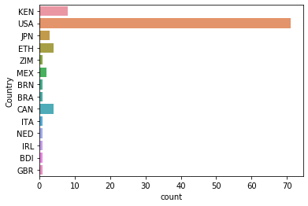
    


```python
Boston_success_df = df_Boston_countries_success_rate.to_frame().reset_index()
Boston_success_df.rename(columns={0:'success_rate'}, inplace=True)
```


```python
sns.catplot(x='success_rate',y='Country', data=Boston_success_df,aspect=3,kind='bar')
```


    <seaborn.axisgrid.FacetGrid at 0x10158080>


    

    


#### Eliminate the 3 countries - BDI, BRN and ZIM since they have only 1 participant. Plot for ETH and KEN. Show the success ratio plot as well. Show values of each bar in the graph.

Doing the same analysis for Moscow and get the total number of countries participating in the run


```python
df_country_moscow=df_Moscow.groupby('Country').size()
```


```python
df_top1000_country_moscow=df_Moscow[:1000].groupby('Country').size()
df_top1000_country_moscow
```


    Country
    CHN      1
    HKG     10
    RUS    903
    THA     86
    dtype: int64


```python
success_rate_by_country_moscow =((df_top1000_country_moscow/df_country_moscow)* 100).nlargest(4)
success_rate_by_country_moscow
```


    Country
    THA    69.354839
    HKG    34.482759
    RUS    11.134402
    CHN     1.960784
    dtype: float64


Plot of top 1000 finishers by countries


```python
sns.countplot(y='Country',data =df_Moscow[:1000])   
```


    <matplotlib.axes._subplots.AxesSubplot at 0xf2aa160>


    
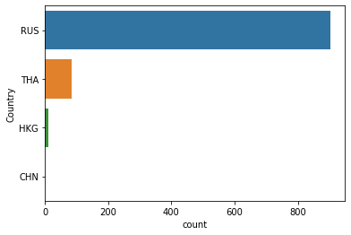
    


```python
Moscow_success_df = success_rate_by_country_moscow.to_frame().reset_index()
Moscow_success_df.rename(columns={0:'success_rate'}, inplace=True)
```


```python
sns.catplot(x='success_rate',y='Country', data=Moscow_success_df,aspect=3,kind='bar')
```


    <seaborn.axisgrid.FacetGrid at 0x10196320>


    

    


Doing the same analysis for merged data. This will show success rate for the combined two runs.


```python
df_merged_bm_country=df_merged_bm.groupby('Country').size()
```


    ---------------------------------------------------------------------------

    NameError                                 Traceback (most recent call last)

    <ipython-input-1-b3695a4b09ad> in <module>
    ----> 1 df_merged_bm_country=df_merged_bm.groupby('Country').size()
    

    NameError: name 'df_merged_bm' is not defined


```python
df_merged_bm_country_500=df_merged_bm[:5000].groupby('Country').size()
```


```python
df_merged_bm_success_rate =((df_merged_bm_country_500/df_merged_bm_country)* 100).nlargest(20) #expected finding Kenya has highest success rate
df_merged_bm_success_rate
```


    Country
    BDI    100.000000
    BRN    100.000000
    ETH    100.000000
    IRN    100.000000
    KEN    100.000000
    MKD    100.000000
    ZIM    100.000000
    CHE     60.000000
    LVA     60.000000
    EGY     50.000000
    PAN     50.000000
    UZB     50.000000
    DNK     42.857143
    UKR     37.500000
    BLR     35.555556
    BER     33.333333
    CAY     33.333333
    CRC     33.333333
    DOM     33.333333
    GUA     33.333333
    dtype: float64


```python
df_merged_bm_success_rate_df = df_merged_bm_success_rate.to_frame().reset_index()
df_merged_bm_success_rate_df.rename(columns={0:'success_rate'}, inplace=True)
#df_merged_bm_success_rate_df.head()
```


```python
sns.catplot(x='success_rate',y='Country', data=df_merged_bm_success_rate_df,aspect=2,kind='bar')
```


    <seaborn.axisgrid.FacetGrid at 0x10184a20>


    
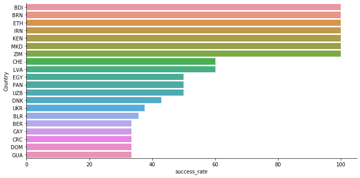
    


```python
df_merged_bm_country = df_merged_bm.groupby('Country').count()
df_merged_bm_country[df_merged_bm_country > 100]
```


<div>
 
<table border="1" class="dataframe">
  <thead>
    <tr style="text-align: right;">
      <th></th>
      <th>Name</th>
      <th>Age</th>
      <th>Gender</th>
      <th>City</th>
      <th>Overall_ranking</th>
      <th>Final_10k_sec</th>
      <th>Final_Half_sec</th>
      <th>FinishTime_sec</th>
      <th>isBoston</th>
    </tr>
    <tr>
      <th>Country</th>
      <th></th>
      <th></th>
      <th></th>
      <th></th>
      <th></th>
      <th></th>
      <th></th>
      <th></th>
      <th></th>
    </tr>
  </thead>
  <tbody>
    <tr>
      <th>-</th>
      <td>NaN</td>
      <td>NaN</td>
      <td>NaN</td>
      <td>NaN</td>
      <td>NaN</td>
      <td>NaN</td>
      <td>NaN</td>
      <td>NaN</td>
      <td>NaN</td>
    </tr>
    <tr>
      <th>ALG</th>
      <td>NaN</td>
      <td>NaN</td>
      <td>NaN</td>
      <td>NaN</td>
      <td>NaN</td>
      <td>NaN</td>
      <td>NaN</td>
      <td>NaN</td>
      <td>NaN</td>
    </tr>
    <tr>
      <th>AND</th>
      <td>NaN</td>
      <td>NaN</td>
      <td>NaN</td>
      <td>NaN</td>
      <td>NaN</td>
      <td>NaN</td>
      <td>NaN</td>
      <td>NaN</td>
      <td>NaN</td>
    </tr>
    <tr>
      <th>ARE</th>
      <td>NaN</td>
      <td>NaN</td>
      <td>NaN</td>
      <td>NaN</td>
      <td>NaN</td>
      <td>NaN</td>
      <td>NaN</td>
      <td>NaN</td>
      <td>NaN</td>
    </tr>
    <tr>
      <th>ARG</th>
      <td>NaN</td>
      <td>NaN</td>
      <td>NaN</td>
      <td>NaN</td>
      <td>NaN</td>
      <td>NaN</td>
      <td>NaN</td>
      <td>NaN</td>
      <td>NaN</td>
    </tr>
    <tr>
      <th>AUS</th>
      <td>195.0</td>
      <td>195.0</td>
      <td>195.0</td>
      <td>195.0</td>
      <td>195.0</td>
      <td>195.0</td>
      <td>195.0</td>
      <td>195.0</td>
      <td>195.0</td>
    </tr>
    <tr>
      <th>AUT</th>
      <td>NaN</td>
      <td>NaN</td>
      <td>NaN</td>
      <td>NaN</td>
      <td>NaN</td>
      <td>NaN</td>
      <td>NaN</td>
      <td>NaN</td>
      <td>NaN</td>
    </tr>
    <tr>
      <th>AZE</th>
      <td>NaN</td>
      <td>NaN</td>
      <td>NaN</td>
      <td>NaN</td>
      <td>NaN</td>
      <td>NaN</td>
      <td>NaN</td>
      <td>NaN</td>
      <td>NaN</td>
    </tr>
    <tr>
      <th>BAR</th>
      <td>NaN</td>
      <td>NaN</td>
      <td>NaN</td>
      <td>NaN</td>
      <td>NaN</td>
      <td>NaN</td>
      <td>NaN</td>
      <td>NaN</td>
      <td>NaN</td>
    </tr>
    <tr>
      <th>BDI</th>
      <td>NaN</td>
      <td>NaN</td>
      <td>NaN</td>
      <td>NaN</td>
      <td>NaN</td>
      <td>NaN</td>
      <td>NaN</td>
      <td>NaN</td>
      <td>NaN</td>
    </tr>
    <tr>
      <th>BEL</th>
      <td>NaN</td>
      <td>NaN</td>
      <td>NaN</td>
      <td>NaN</td>
      <td>NaN</td>
      <td>NaN</td>
      <td>NaN</td>
      <td>NaN</td>
      <td>NaN</td>
    </tr>
    <tr>
      <th>BER</th>
      <td>NaN</td>
      <td>NaN</td>
      <td>NaN</td>
      <td>NaN</td>
      <td>NaN</td>
      <td>NaN</td>
      <td>NaN</td>
      <td>NaN</td>
      <td>NaN</td>
    </tr>
    <tr>
      <th>BIH</th>
      <td>NaN</td>
      <td>NaN</td>
      <td>NaN</td>
      <td>NaN</td>
      <td>NaN</td>
      <td>NaN</td>
      <td>NaN</td>
      <td>NaN</td>
      <td>NaN</td>
    </tr>
    <tr>
      <th>BLR</th>
      <td>NaN</td>
      <td>NaN</td>
      <td>NaN</td>
      <td>NaN</td>
      <td>NaN</td>
      <td>NaN</td>
      <td>NaN</td>
      <td>NaN</td>
      <td>NaN</td>
    </tr>
    <tr>
      <th>BRA</th>
      <td>206.0</td>
      <td>206.0</td>
      <td>206.0</td>
      <td>206.0</td>
      <td>206.0</td>
      <td>206.0</td>
      <td>206.0</td>
      <td>206.0</td>
      <td>206.0</td>
    </tr>
    <tr>
      <th>BRN</th>
      <td>NaN</td>
      <td>NaN</td>
      <td>NaN</td>
      <td>NaN</td>
      <td>NaN</td>
      <td>NaN</td>
      <td>NaN</td>
      <td>NaN</td>
      <td>NaN</td>
    </tr>
    <tr>
      <th>BUL</th>
      <td>NaN</td>
      <td>NaN</td>
      <td>NaN</td>
      <td>NaN</td>
      <td>NaN</td>
      <td>NaN</td>
      <td>NaN</td>
      <td>NaN</td>
      <td>NaN</td>
    </tr>
    <tr>
      <th>CAN</th>
      <td>1871.0</td>
      <td>1871.0</td>
      <td>1871.0</td>
      <td>1871.0</td>
      <td>1871.0</td>
      <td>1871.0</td>
      <td>1871.0</td>
      <td>1871.0</td>
      <td>1871.0</td>
    </tr>
    <tr>
      <th>CAY</th>
      <td>NaN</td>
      <td>NaN</td>
      <td>NaN</td>
      <td>NaN</td>
      <td>NaN</td>
      <td>NaN</td>
      <td>NaN</td>
      <td>NaN</td>
      <td>NaN</td>
    </tr>
    <tr>
      <th>CHE</th>
      <td>NaN</td>
      <td>NaN</td>
      <td>NaN</td>
      <td>NaN</td>
      <td>NaN</td>
      <td>NaN</td>
      <td>NaN</td>
      <td>NaN</td>
      <td>NaN</td>
    </tr>
    <tr>
      <th>CHI</th>
      <td>NaN</td>
      <td>NaN</td>
      <td>NaN</td>
      <td>NaN</td>
      <td>NaN</td>
      <td>NaN</td>
      <td>NaN</td>
      <td>NaN</td>
      <td>NaN</td>
    </tr>
    <tr>
      <th>CHN</th>
      <td>293.0</td>
      <td>293.0</td>
      <td>293.0</td>
      <td>293.0</td>
      <td>293.0</td>
      <td>293.0</td>
      <td>293.0</td>
      <td>293.0</td>
      <td>293.0</td>
    </tr>
    <tr>
      <th>COL</th>
      <td>NaN</td>
      <td>NaN</td>
      <td>NaN</td>
      <td>NaN</td>
      <td>NaN</td>
      <td>NaN</td>
      <td>NaN</td>
      <td>NaN</td>
      <td>NaN</td>
    </tr>
    <tr>
      <th>CRC</th>
      <td>NaN</td>
      <td>NaN</td>
      <td>NaN</td>
      <td>NaN</td>
      <td>NaN</td>
      <td>NaN</td>
      <td>NaN</td>
      <td>NaN</td>
      <td>NaN</td>
    </tr>
    <tr>
      <th>CRO</th>
      <td>NaN</td>
      <td>NaN</td>
      <td>NaN</td>
      <td>NaN</td>
      <td>NaN</td>
      <td>NaN</td>
      <td>NaN</td>
      <td>NaN</td>
      <td>NaN</td>
    </tr>
    <tr>
      <th>CZE</th>
      <td>NaN</td>
      <td>NaN</td>
      <td>NaN</td>
      <td>NaN</td>
      <td>NaN</td>
      <td>NaN</td>
      <td>NaN</td>
      <td>NaN</td>
      <td>NaN</td>
    </tr>
    <tr>
      <th>DEN</th>
      <td>NaN</td>
      <td>NaN</td>
      <td>NaN</td>
      <td>NaN</td>
      <td>NaN</td>
      <td>NaN</td>
      <td>NaN</td>
      <td>NaN</td>
      <td>NaN</td>
    </tr>
    <tr>
      <th>DEU</th>
      <td>NaN</td>
      <td>NaN</td>
      <td>NaN</td>
      <td>NaN</td>
      <td>NaN</td>
      <td>NaN</td>
      <td>NaN</td>
      <td>NaN</td>
      <td>NaN</td>
    </tr>
    <tr>
      <th>DNK</th>
      <td>NaN</td>
      <td>NaN</td>
      <td>NaN</td>
      <td>NaN</td>
      <td>NaN</td>
      <td>NaN</td>
      <td>NaN</td>
      <td>NaN</td>
      <td>NaN</td>
    </tr>
    <tr>
      <th>DOM</th>
      <td>NaN</td>
      <td>NaN</td>
      <td>NaN</td>
      <td>NaN</td>
      <td>NaN</td>
      <td>NaN</td>
      <td>NaN</td>
      <td>NaN</td>
      <td>NaN</td>
    </tr>
    <tr>
      <th>...</th>
      <td>...</td>
      <td>...</td>
      <td>...</td>
      <td>...</td>
      <td>...</td>
      <td>...</td>
      <td>...</td>
      <td>...</td>
      <td>...</td>
    </tr>
    <tr>
      <th>PER</th>
      <td>NaN</td>
      <td>NaN</td>
      <td>NaN</td>
      <td>NaN</td>
      <td>NaN</td>
      <td>NaN</td>
      <td>NaN</td>
      <td>NaN</td>
      <td>NaN</td>
    </tr>
    <tr>
      <th>PHI</th>
      <td>NaN</td>
      <td>NaN</td>
      <td>NaN</td>
      <td>NaN</td>
      <td>NaN</td>
      <td>NaN</td>
      <td>NaN</td>
      <td>NaN</td>
      <td>NaN</td>
    </tr>
    <tr>
      <th>POL</th>
      <td>NaN</td>
      <td>NaN</td>
      <td>NaN</td>
      <td>NaN</td>
      <td>NaN</td>
      <td>NaN</td>
      <td>NaN</td>
      <td>NaN</td>
      <td>NaN</td>
    </tr>
    <tr>
      <th>POR</th>
      <td>NaN</td>
      <td>NaN</td>
      <td>NaN</td>
      <td>NaN</td>
      <td>NaN</td>
      <td>NaN</td>
      <td>NaN</td>
      <td>NaN</td>
      <td>NaN</td>
    </tr>
    <tr>
      <th>PRT</th>
      <td>NaN</td>
      <td>NaN</td>
      <td>NaN</td>
      <td>NaN</td>
      <td>NaN</td>
      <td>NaN</td>
      <td>NaN</td>
      <td>NaN</td>
      <td>NaN</td>
    </tr>
    <tr>
      <th>ROU</th>
      <td>NaN</td>
      <td>NaN</td>
      <td>NaN</td>
      <td>NaN</td>
      <td>NaN</td>
      <td>NaN</td>
      <td>NaN</td>
      <td>NaN</td>
      <td>NaN</td>
    </tr>
    <tr>
      <th>RSA</th>
      <td>NaN</td>
      <td>NaN</td>
      <td>NaN</td>
      <td>NaN</td>
      <td>NaN</td>
      <td>NaN</td>
      <td>NaN</td>
      <td>NaN</td>
      <td>NaN</td>
    </tr>
    <tr>
      <th>RUS</th>
      <td>8139.0</td>
      <td>8139.0</td>
      <td>8139.0</td>
      <td>8139.0</td>
      <td>8139.0</td>
      <td>8138.0</td>
      <td>8139.0</td>
      <td>8139.0</td>
      <td>8139.0</td>
    </tr>
    <tr>
      <th>SEN</th>
      <td>NaN</td>
      <td>NaN</td>
      <td>NaN</td>
      <td>NaN</td>
      <td>NaN</td>
      <td>NaN</td>
      <td>NaN</td>
      <td>NaN</td>
      <td>NaN</td>
    </tr>
    <tr>
      <th>SIN</th>
      <td>NaN</td>
      <td>NaN</td>
      <td>NaN</td>
      <td>NaN</td>
      <td>NaN</td>
      <td>NaN</td>
      <td>NaN</td>
      <td>NaN</td>
      <td>NaN</td>
    </tr>
    <tr>
      <th>SLO</th>
      <td>NaN</td>
      <td>NaN</td>
      <td>NaN</td>
      <td>NaN</td>
      <td>NaN</td>
      <td>NaN</td>
      <td>NaN</td>
      <td>NaN</td>
      <td>NaN</td>
    </tr>
    <tr>
      <th>SMR</th>
      <td>NaN</td>
      <td>NaN</td>
      <td>NaN</td>
      <td>NaN</td>
      <td>NaN</td>
      <td>NaN</td>
      <td>NaN</td>
      <td>NaN</td>
      <td>NaN</td>
    </tr>
    <tr>
      <th>SRB</th>
      <td>NaN</td>
      <td>NaN</td>
      <td>NaN</td>
      <td>NaN</td>
      <td>NaN</td>
      <td>NaN</td>
      <td>NaN</td>
      <td>NaN</td>
      <td>NaN</td>
    </tr>
    <tr>
      <th>SUI</th>
      <td>NaN</td>
      <td>NaN</td>
      <td>NaN</td>
      <td>NaN</td>
      <td>NaN</td>
      <td>NaN</td>
      <td>NaN</td>
      <td>NaN</td>
      <td>NaN</td>
    </tr>
    <tr>
      <th>SVK</th>
      <td>NaN</td>
      <td>NaN</td>
      <td>NaN</td>
      <td>NaN</td>
      <td>NaN</td>
      <td>NaN</td>
      <td>NaN</td>
      <td>NaN</td>
      <td>NaN</td>
    </tr>
    <tr>
      <th>SVN</th>
      <td>NaN</td>
      <td>NaN</td>
      <td>NaN</td>
      <td>NaN</td>
      <td>NaN</td>
      <td>NaN</td>
      <td>NaN</td>
      <td>NaN</td>
      <td>NaN</td>
    </tr>
    <tr>
      <th>SWE</th>
      <td>NaN</td>
      <td>NaN</td>
      <td>NaN</td>
      <td>NaN</td>
      <td>NaN</td>
      <td>NaN</td>
      <td>NaN</td>
      <td>NaN</td>
      <td>NaN</td>
    </tr>
    <tr>
      <th>TCA</th>
      <td>NaN</td>
      <td>NaN</td>
      <td>NaN</td>
      <td>NaN</td>
      <td>NaN</td>
      <td>NaN</td>
      <td>NaN</td>
      <td>NaN</td>
      <td>NaN</td>
    </tr>
    <tr>
      <th>THA</th>
      <td>129.0</td>
      <td>129.0</td>
      <td>129.0</td>
      <td>129.0</td>
      <td>129.0</td>
      <td>129.0</td>
      <td>129.0</td>
      <td>129.0</td>
      <td>129.0</td>
    </tr>
    <tr>
      <th>TRI</th>
      <td>NaN</td>
      <td>NaN</td>
      <td>NaN</td>
      <td>NaN</td>
      <td>NaN</td>
      <td>NaN</td>
      <td>NaN</td>
      <td>NaN</td>
      <td>NaN</td>
    </tr>
    <tr>
      <th>TUR</th>
      <td>NaN</td>
      <td>NaN</td>
      <td>NaN</td>
      <td>NaN</td>
      <td>NaN</td>
      <td>NaN</td>
      <td>NaN</td>
      <td>NaN</td>
      <td>NaN</td>
    </tr>
    <tr>
      <th>TWN</th>
      <td>NaN</td>
      <td>NaN</td>
      <td>NaN</td>
      <td>NaN</td>
      <td>NaN</td>
      <td>NaN</td>
      <td>NaN</td>
      <td>NaN</td>
      <td>NaN</td>
    </tr>
    <tr>
      <th>UAE</th>
      <td>NaN</td>
      <td>NaN</td>
      <td>NaN</td>
      <td>NaN</td>
      <td>NaN</td>
      <td>NaN</td>
      <td>NaN</td>
      <td>NaN</td>
      <td>NaN</td>
    </tr>
    <tr>
      <th>UKR</th>
      <td>NaN</td>
      <td>NaN</td>
      <td>NaN</td>
      <td>NaN</td>
      <td>NaN</td>
      <td>NaN</td>
      <td>NaN</td>
      <td>NaN</td>
      <td>NaN</td>
    </tr>
    <tr>
      <th>URU</th>
      <td>NaN</td>
      <td>NaN</td>
      <td>NaN</td>
      <td>NaN</td>
      <td>NaN</td>
      <td>NaN</td>
      <td>NaN</td>
      <td>NaN</td>
      <td>NaN</td>
    </tr>
    <tr>
      <th>USA</th>
      <td>20945.0</td>
      <td>20945.0</td>
      <td>20945.0</td>
      <td>20945.0</td>
      <td>20945.0</td>
      <td>20945.0</td>
      <td>20945.0</td>
      <td>20945.0</td>
      <td>20945.0</td>
    </tr>
    <tr>
      <th>UZB</th>
      <td>NaN</td>
      <td>NaN</td>
      <td>NaN</td>
      <td>NaN</td>
      <td>NaN</td>
      <td>NaN</td>
      <td>NaN</td>
      <td>NaN</td>
      <td>NaN</td>
    </tr>
    <tr>
      <th>VEN</th>
      <td>NaN</td>
      <td>NaN</td>
      <td>NaN</td>
      <td>NaN</td>
      <td>NaN</td>
      <td>NaN</td>
      <td>NaN</td>
      <td>NaN</td>
      <td>NaN</td>
    </tr>
    <tr>
      <th>ZAF</th>
      <td>NaN</td>
      <td>NaN</td>
      <td>NaN</td>
      <td>NaN</td>
      <td>NaN</td>
      <td>NaN</td>
      <td>NaN</td>
      <td>NaN</td>
      <td>NaN</td>
    </tr>
    <tr>
      <th>ZIM</th>
      <td>NaN</td>
      <td>NaN</td>
      <td>NaN</td>
      <td>NaN</td>
      <td>NaN</td>
      <td>NaN</td>
      <td>NaN</td>
      <td>NaN</td>
      <td>NaN</td>
    </tr>
  </tbody>
</table>
<p>113 rows × 9 columns</p>
</div>


Show agreegated result of boston and moscow success rate in one graph. Still on different datasets.


```python
Boston_success_df = df_Boston_countries_success_rate.to_frame().reset_index()
Boston_success_df.rename(columns={0:'success_rate'}, inplace=True)
Boston_success_df['isBoston'] = '1.0'
#Boston_success_df.head(1)
```


    ---------------------------------------------------------------------------

    NameError                                 Traceback (most recent call last)

    <ipython-input-2-706243f5f236> in <module>
    ----> 1 Boston_success_df = df_Boston_countries_success_rate.to_frame().reset_index()
          2 Boston_success_df.rename(columns={0:'success_rate'}, inplace=True)
          3 Boston_success_df['isBoston'] = '1.0'
          4 #Boston_success_df.head(1)


    NameError: name 'df_Boston_countries_success_rate' is not defined


```python
Moscow_success_df = success_rate_by_country_moscow.to_frame().reset_index()
Moscow_success_df.rename(columns={0:'success_rate'}, inplace=True)
Moscow_success_df['isBoston'] = '0.0'
#Moscow_success_df.head(1)
```


```python
df_merge_success_rate = Boston_success_df.merge(Moscow_success_df,how='outer', left_on=['Country', 'success_rate', 'isBoston'],\
                                     right_on=['Country', 'success_rate', 'isBoston'])
```


```python
df_merge_success_rate = df_merge_success_rate.sort_values(by='success_rate', ascending=False)
```


```python
sns.catplot(x='success_rate',y='Country',hue='isBoston',data=df_merge_success_rate,aspect=3,kind='bar')
```


    <seaborn.axisgrid.FacetGrid at 0x536c128>


    

    


# <u> Managerial Insights</u>

<ul>
    <li>To perform well in long run marathons athletes should follow the practices what Kenya and Thailand athletes have implemented. As Kenya athletes have a dominance in the olympics and most recently Thailand is  seeing the hobby jogging boom. </li>
    <li> Kenya and Thailand athletes are used to perform in severe conditions, so they have the capacity to manage well in Boston and Moscow Marathon </li>
    <li>Kenya as a country has the most successful representation in the run. The runners from Kenya are really fast and they are amongst the winners as well. In order to make the run more competitive and atttractive sponsors and viewers, we should make sure to have good representation from Kenya and top Kenyan players. This will drive more advertising and sponsorship money to the run. Don't just focus on local talent but rather go for the bigger talent from abroad.</li>
</ul>

# <u>  Interesting Finding 2 Summary </u>

<ul>
    <li> Summary - Negative split is not an effective nor popular strategy for Boston Marathon. </li>
    <li> Background - Negative split is a very popular and common strategy where a runner runs the second half of a marathon </li>
    <li> Faster than the first half. </li>


```python
import matplotlib.pyplot as plt
df_Boston['boston_split_ratio'] = (df_Boston['FinishTime_sec'] - df_Boston['Final_Half_sec'])/(df_Boston['Final_Half_sec'])
df_split = df_Boston[df_Boston.Final_Half_sec > 0]
```


```python
len(df_split[df_split.boston_split_ratio < 1.0])
```


    811


```python
len(df_Boston[df_Boston.boston_split_ratio < 1.0]) / len(df_Boston) * 100
```


    3.070806512684589


Proves that mature people use negative split and not young.


```python
df_split[df_split.boston_split_ratio < 1.0].groupby(['Gender']).size() 
```


    Gender
    0.0    377
    1.0    434
    dtype: int64


```python
sns.kdeplot(df_split.boston_split_ratio)
plt.xlim([0.7,1.7])
plt.xlabel('Boston Split Ratio')
plt.ylabel('Runner Density')
plt.title('Split Distribution (Negative split when < 1)')
```


    <matplotlib.axes._subplots.AxesSubplot at 0xf291c50>


    (0.7, 1.7)


    Text(0.5, 0, 'Boston Split Ratio')


    Text(0, 0.5, 'Runner Density')


    Text(0.5, 1.0, 'Split Distribution (Negative split when < 1)')


    
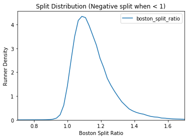
    


```python
plt.plot(df_split.Overall_ranking,df_split.boston_split_ratio,'o', alpha = 0.2)
plt.ylim([0.5,3])
plt.xlabel('Overall Ranking')
plt.ylabel('Split Ratio')
plt.title('Split and performance')
```


    [<matplotlib.lines.Line2D at 0x100b5a58>]


    (0.5, 3)


    Text(0.5, 0, 'Overall Ranking')


    Text(0, 0.5, 'Split Ratio')


    Text(0.5, 1.0, 'Split and performance')


    
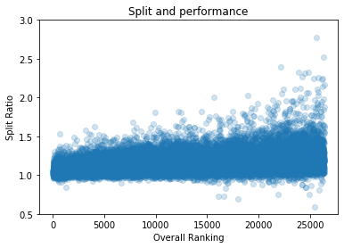
    


Till here, we should show how many have positive split and how many have negative split. Show them by age and gender.
Plot split ratio of each runner by finish time.
Variance in split ratio by age? by gender?

Derive split of top 100 from the above dataframe to optimize.


```python
dfBoston_100 = df_Boston[:100]
dfBoston_100['split_ratio_100'] = (dfBoston_100['FinishTime_sec'] - dfBoston_100['Final_Half_sec'])/(dfBoston_100['Final_Half_sec'])
df_split_100 = dfBoston_100[dfBoston_100.Final_Half_sec > 0]
```

Top 10 runners have not used negative split.

The below chart shows that successful countries didn't solely use negative split strategy. 


```python
plt.plot(df_split_100.Overall_ranking,df_split_100.split_ratio_100,'o', alpha = 0.2)
plt.ylim([0.8,1.4])
plt.xlabel('Overall Rank')
plt.ylabel('Split')
plt.title('Split and performance') 
```


    [<matplotlib.lines.Line2D at 0x10113b38>]


    (0.8, 1.4)


    Text(0.5, 0, 'Overall Rank')


    Text(0, 0.5, 'Split')


    Text(0.5, 1.0, 'Split and performance')


    
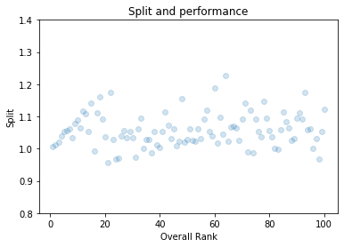
    


```python
# Till here, we should show how many have +ve split and how many have negative split. Show them by age and gender.
# plot split ratio of each runner by finish time.  split ratio on y axis and finish time on x.
# variance in split ratio by age? by gender?
```


```python
plt.plot(df_split.Overall_ranking[(df_split.Country is not 'KEN') & (df_split.Overall_ranking<100)], df_split.boston_split_ratio[(df_split.Country is not 'KEN') & (df_split.Overall_ranking<100)],'o')

plt.plot(df_split.Overall_ranking[(df_split.Country == 'KEN') & (df_split.Overall_ranking<100)], df_split.boston_split_ratio[(df_split.Country == 'KEN')  & (df_split.Overall_ranking<100)],'o', color = 'r')
plt.xlabel('Overall Rank')
plt.ylabel('Split Ratio')
plt.legend(['Others','Kenya'])
```


    [<matplotlib.lines.Line2D at 0x13988da0>]


    [<matplotlib.lines.Line2D at 0x13994438>]


    Text(0.5, 0, 'Overall Rank')


    Text(0, 0.5, 'Split Ratio')


    <matplotlib.legend.Legend at 0x13988ef0>


    
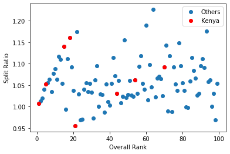
    


```python
#doing same analysis for moscow.
```


```python
import matplotlib.pyplot as plt
df_new_Moscow['moscow_split_ratio'] = (df_new_Moscow['Marathon'] - df_new_Moscow['Half marathon'])/(df_new_Moscow['Half marathon'])
# count number of positive split and number of negative split. Plot it.
```


```python
sns.kdeplot(df_new_Moscow.moscow_split_ratio)
plt.xlim([0.7,1.8])
plt.xlabel('Split Ratio')
plt.title('Split Distribution (Negative split when < 1)')
# what does y axis represent? is it count?
```


    <matplotlib.axes._subplots.AxesSubplot at 0x139cc588>


    (0.7, 1.8)


    Text(0.5, 0, 'Split Ratio')


    Text(0.5, 1.0, 'Split Distribution (Negative split when < 1)')


    
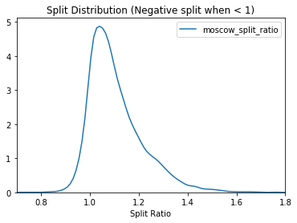
    


```python
plt.plot(df_new_Moscow.Overall_Ranking,df_new_Moscow.moscow_split_ratio,'o', alpha = 0.2)
plt.ylim([0.5,2.2])
plt.xlabel('Overall_Ranking')
plt.ylabel('Split Ratio')
plt.title('Split Ratio and performance')
```


    [<matplotlib.lines.Line2D at 0x13c8d160>]


    (0.5, 2.2)


    Text(0.5, 0, 'Overall_Ranking')


    Text(0, 0.5, 'Split Ratio')


    Text(0.5, 1.0, 'Split Ratio and performance')


    
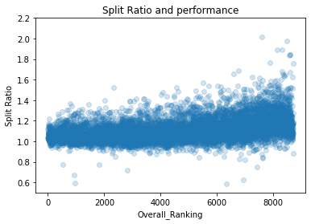
    


```python
len(df_new_Moscow[df_new_Moscow.moscow_split_ratio < 1.0])
```


    935


```python
len(df_new_Moscow[df_new_Moscow.moscow_split_ratio < 1.0]) / len(df_new_Moscow) * 100
```


    10.744656400827395


Derive split of top 100 from the above df to optimize.


```python
dfMoscow_100 = df_new_Moscow[:100]
dfMoscow_100['split_ratio_100'] = (dfMoscow_100['Marathon'] - dfMoscow_100['Half marathon'])/(dfMoscow_100['Half marathon'])
df_split_moscow_100 = dfMoscow_100
sns.kdeplot(df_split_moscow_100.split_ratio_100)
plt.xlim([0.7,1.7])
plt.xlabel('Split Ratio')
plt.title('Split Distribution (Negative split when < 1)')
```


    <matplotlib.axes._subplots.AxesSubplot at 0x13c991d0>


    (0.7, 1.7)


    Text(0.5, 0, 'Split Ratio')


    Text(0.5, 1.0, 'Split Distribution (Negative split when < 1)')


    
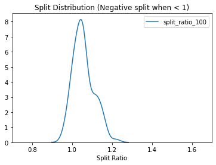
    


```python
plt.plot(df_split_moscow_100.Overall_Ranking,df_split_moscow_100.split_ratio_100,'o', alpha = 0.2)
plt.ylim([0.9,1.3])
plt.xlabel('Overall Rank')
plt.ylabel('Split')
plt.title('Split and performance')
```


    [<matplotlib.lines.Line2D at 0x14ed58d0>]


    (0.9, 1.3)


    Text(0.5, 0, 'Overall Rank')


    Text(0, 0.5, 'Split')


    Text(0.5, 1.0, 'Split and performance')


    
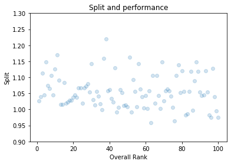
    


```python
len(df_split_moscow_100)
```


    100


Count number of positive split and number of negative split. Plot it.


```python
import matplotlib.pyplot as plt
df_merged_bm['split_ratio'] = (df_merged_bm['FinishTime_sec'] - df_merged_bm['Final_Half_sec'])/(df_merged_bm['Final_Half_sec'])
```


```python
type(df_split.boston_split_ratio)
```


    pandas.core.series.Series


```python
f, ax = plt.subplots(figsize=(8, 8))
ax = sns.kdeplot(df_split.boston_split_ratio, legend=True)
ax = sns.kdeplot(df_new_Moscow.moscow_split_ratio, legend=True)
#sns.lineplot(x='split_ratio',y='FinishTime_sec',hue='isBoston',data=df_Boston,aspect=2,kind='point')
plt.xlim([0.2,2.8])
plt.xlabel('Split Ratio')
plt.ylabel('Runner Density')
plt.title('Split Distribution (Negative split when < 1)')
# what does y axis represent? is it count?
```


    (0.2, 2.8)


    Text(0.5, 0, 'Split Ratio')


    Text(0, 0.5, 'Runner Density')


    Text(0.5, 1.0, 'Split Distribution (Negative split when < 1)')


    
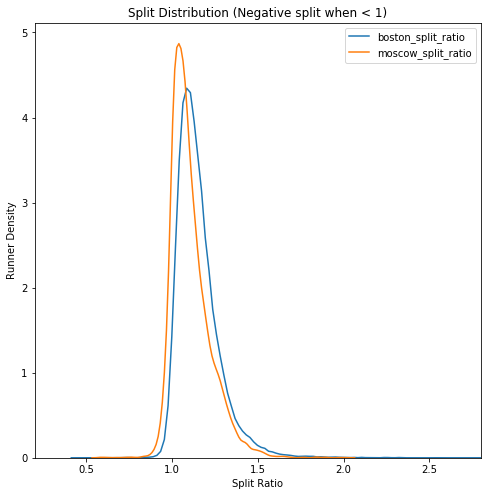
    


```python
plt.plot(df_merged_bm.Overall_ranking,df_merged_bm.split_ratio,'o', alpha = 0.2)
plt.ylim([0.5,2.2])
plt.xlabel('Overall_Ranking')
plt.ylabel('Split')
plt.title('Split and performance')
```


    [<matplotlib.lines.Line2D at 0x14fa7be0>]


    (0.5, 2.2)


    Text(0.5, 0, 'Overall_Ranking')


    Text(0, 0.5, 'Split')


    Text(0.5, 1.0, 'Split and performance')


    
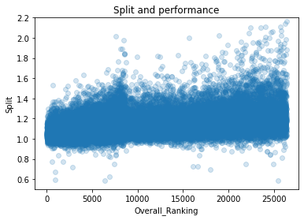
    


# <u> Managerial Insights </u>

<ul>
    <li> After doing the analysis, we observed that to perfrom well in Marathon athletes should use the even split strategy that is athlete should keep his/her pace consistent throughout the marathon instead of conserving the energy for first or second split of the marathon </li>
    <li> It is advisable to athlete to practice their chosen strategy in training to help set the realistic expectation and to learn how their body is going to respond. </li>
    </ul>

# <u>  Interesting Finding 3 Summary </u>

<ul>
    <li> Summary - Middle aged athletes are faster as compare to younger aged athletes. </li>
</ul>


```python
df_Boston['binned_age1']= pd.cut(df_Boston.Age,bins=[15,25,35,45,55,70])
```


```python
df_Boston[df_Boston.Gender == 1.0].Age.describe()      # male dataset details.    #REMOVE!!!
```


    count    14438.000000
    mean        44.772475
    std         11.533255
    min         18.000000
    25%         36.000000
    50%         45.000000
    75%         53.000000
    max         83.000000
    Name: Age, dtype: float64


```python
df_Boston[df_Boston.Gender == 0.0].Age.describe() #REMOVE!!!
```


    count    11972.000000
    mean        39.952974
    std         10.703554
    min         18.000000
    25%         31.000000
    50%         40.000000
    75%         48.000000
    max         84.000000
    Name: Age, dtype: float64


Unexpected as middle aged person more participated as compared to young.


```python
df_Boston.groupby('Age').size().nlargest(5) 
```


    Age
    45    1127
    46     976
    40     926
    47     843
    50     815
    dtype: int64


```python
df_Boston.groupby('Gender').size()
```


    Gender
    0.0    11972
    1.0    14438
    dtype: int64


```python
df_Boston.groupby(['Gender','binned_age1']).size()
```


    Gender  binned_age1
    0.0     (15, 25]       1067
            (25, 35]       3350
            (35, 45]       3780
            (45, 55]       2823
            (55, 70]        932
    1.0     (15, 25]        691
            (25, 35]       2710
            (35, 45]       3991
            (45, 55]       4316
            (55, 70]       2623
    dtype: int64


```python
sns.countplot(x='binned_age1',hue='Gender',data=df_Boston)
```


    <matplotlib.axes._subplots.AxesSubplot at 0x14fe5978>


    
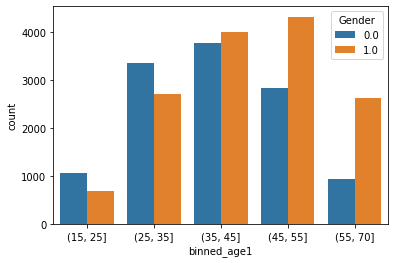
    


```python
df_Boston['binned_age2']= pd.cut(df_Boston.Age,bins=[15,20,25,29,35,40,45,50,70])
```


```python
sns.factorplot(x='binned_age2',y='FinishTime_sec',hue='Gender',data=df_Boston,aspect=2,kind='point')
```


    <seaborn.axisgrid.FacetGrid at 0x14f8a240>


    
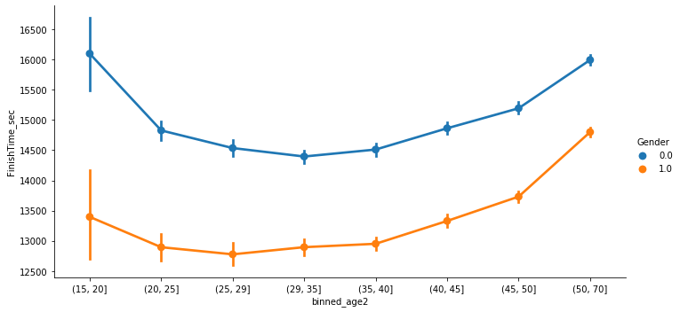
    


Older and mature people perform the best and are the faster marathon runner. Older and mature people also participated
more than young people and are more health considerate.


```python
df_new_Moscow.head()
```


<div>
 
<table border="1" class="dataframe">
  <thead>
    <tr style="text-align: right;">
      <th></th>
      <th>BibNo</th>
      <th>Finish_Time_Sec</th>
      <th>Pace_Sec</th>
      <th>Pace_Minpkm</th>
      <th>Half_Pace_Sec</th>
      <th>Half_Pace_Minpkm</th>
      <th>Gender</th>
      <th>Age</th>
      <th>Name</th>
      <th>City</th>
      <th>Country</th>
      <th>10 km</th>
      <th>Half marathon</th>
      <th>Marathon</th>
      <th>Overall_Ranking</th>
      <th>moscow_split_ratio</th>
    </tr>
  </thead>
  <tbody>
    <tr>
      <th>0</th>
      <td>3</td>
      <td>8122.0</td>
      <td>192.487261</td>
      <td>3:12 min/km</td>
      <td>189.880318</td>
      <td>3:09 min/km</td>
      <td>Male</td>
      <td>31</td>
      <td>Stepan Kiselev</td>
      <td>Kazan'</td>
      <td>RUS</td>
      <td>1899.0</td>
      <td>4006.0</td>
      <td>8122.0</td>
      <td>1</td>
      <td>1.027459</td>
    </tr>
    <tr>
      <th>1</th>
      <td>12</td>
      <td>8161.0</td>
      <td>193.411542</td>
      <td>3:13 min/km</td>
      <td>189.738121</td>
      <td>3:09 min/km</td>
      <td>Male</td>
      <td>32</td>
      <td>Aleksey Troshkin</td>
      <td>Saransk</td>
      <td>RUS</td>
      <td>1905.0</td>
      <td>4003.0</td>
      <td>8161.0</td>
      <td>2</td>
      <td>1.038721</td>
    </tr>
    <tr>
      <th>2</th>
      <td>10</td>
      <td>8394.0</td>
      <td>198.933523</td>
      <td>3:18 min/km</td>
      <td>188.268752</td>
      <td>3:08 min/km</td>
      <td>Male</td>
      <td>27</td>
      <td>Artem Aplachkin</td>
      <td>Barnaul</td>
      <td>RUS</td>
      <td>1879.0</td>
      <td>3972.0</td>
      <td>8394.0</td>
      <td>3</td>
      <td>1.113293</td>
    </tr>
    <tr>
      <th>3</th>
      <td>15008</td>
      <td>8416.0</td>
      <td>199.454912</td>
      <td>3:19 min/km</td>
      <td>195.094205</td>
      <td>3:15 min/km</td>
      <td>Male</td>
      <td>29</td>
      <td>Sergey Popov</td>
      <td>Voronezh</td>
      <td>RUS</td>
      <td>1960.0</td>
      <td>4116.0</td>
      <td>8416.0</td>
      <td>4</td>
      <td>1.044704</td>
    </tr>
    <tr>
      <th>4</th>
      <td>4</td>
      <td>8467.0</td>
      <td>200.663586</td>
      <td>3:20 min/km</td>
      <td>186.894182</td>
      <td>3:06 min/km</td>
      <td>Male</td>
      <td>36</td>
      <td>Dmitriy Safronov</td>
      <td>Moskva</td>
      <td>RUS</td>
      <td>1876.0</td>
      <td>3943.0</td>
      <td>8467.0</td>
      <td>5</td>
      <td>1.147350</td>
    </tr>
  </tbody>
</table>
</div>


```python
df_new_Moscow['binned_age1']= pd.cut(df_new_Moscow.Age,bins=[15,25,30,35,40,50,70])
```


```python
df_new_Moscow.groupby('Age').size().nlargest(10)
```


    Age
    31    485
    30    482
    33    468
    32    457
    34    450
    35    434
    29    408
    28    372
    36    360
    37    340
    dtype: int64


```python
df_new_Moscow.groupby(['Gender']).size()
```


    Gender
    Female    1491
    Male      7211
    dtype: int64


```python
df_new_Moscow.groupby(['Gender','binned_age1']).size()
```


    Gender  binned_age1
    Female  (15, 25]        183
            (25, 30]        403
            (30, 35]        395
            (35, 40]        238
            (40, 50]        207
            (50, 70]         63
    Male    (15, 25]        530
            (25, 30]       1401
            (30, 35]       1899
            (35, 40]       1335
            (40, 50]       1409
            (50, 70]        616
    dtype: int64


```python
sns.countplot(x='binned_age1',hue='Gender',data=df_new_Moscow)  # color is opposite for male/female as compared to other graphs.
```


    <matplotlib.axes._subplots.AxesSubplot at 0x16cc04a8>


    
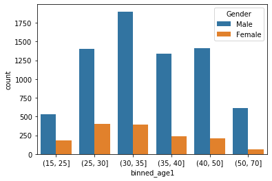
    


```python
df_new_Moscow['binned_age2']= pd.cut(df_new_Moscow.Age,bins=[20,25,30,35,40,45,50,70])
```


```python
sns.factorplot(x='binned_age2',y='Marathon',hue='Gender',data=df_new_Moscow,aspect=3,kind='point')
```


    <seaborn.axisgrid.FacetGrid at 0x16cc0908>


    

    


Analysis on combined dataset.


```python
df_merged_bm['binned_age1']= pd.cut(df_merged_bm.Age,bins=[15,25,30,35,40,45,50,60,70])
```


```python
df_merged_bm.groupby('Age').size().nlargest(10)
```


    Age
    45    1275
    35    1234
    40    1193
    46    1150
    30    1111
    36    1093
    31    1068
    33    1059
    29    1044
    41    1034
    dtype: int64


```python
df_merged_bm.groupby(['Gender']).size()
```


    Gender
    0.0    13463
    1.0    21649
    dtype: int64


```python
df_merged_bm.groupby(['Gender','binned_age1']).size()
```


    Gender  binned_age1
    0.0     (15, 25]       1250
            (25, 30]       2187
            (30, 35]       1961
            (35, 40]       2126
            (40, 45]       2026
            (45, 50]       1774
            (50, 60]       1763
            (60, 70]        354
    1.0     (15, 25]       1221
            (25, 30]       2600
            (30, 35]       3410
            (35, 40]       3175
            (40, 45]       3000
            (45, 50]       2963
            (50, 60]       3834
            (60, 70]       1318
    dtype: int64


Age wise participation across boston and moscow


```python
sns.countplot(x='binned_age1',hue='isBoston',data=df_merged_bm)
```


    <matplotlib.axes._subplots.AxesSubplot at 0x13c5cf28>


    
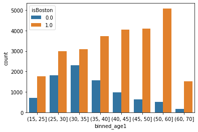
    


```python
sns.countplot(x='binned_age1',hue='isBoston',data=df_merged_bm[df_merged_bm.Gender == 1.0])
```


    <matplotlib.axes._subplots.AxesSubplot at 0x15239f60>


    
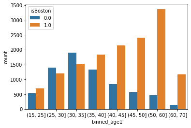
    


Age across boston and moscow for binned ages BUT only for females


```python
sns.countplot(x='binned_age1',hue='isBoston',data=df_merged_bm[df_merged_bm.Gender == 0.0])
```


    <matplotlib.axes._subplots.AxesSubplot at 0x16344cf8>


    
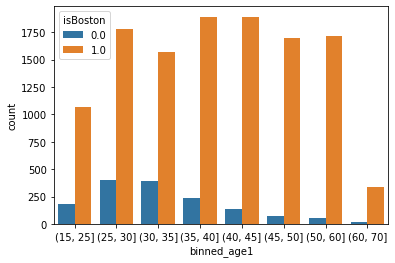
    


```python
#df_new_Moscow[(df_new_Moscow.Age > 45) & (df_new_Moscowdd.Gender == 'Female')][['Age', 'Marathon']]
```

Binned age for combined df


```python
df_merged_bm['binned_age']=pd.cut(df_merged_bm.Age,bins=[20,25,30,35,40,45,50,70])
```

Plot to show finish time across both marathons for binned ages.


```python
sns.factorplot(x='binned_age',y='FinishTime_sec',hue='isBoston',data=df_merged_bm,aspect=2,kind='point')
```


    <seaborn.axisgrid.FacetGrid at 0x1525f668>


    
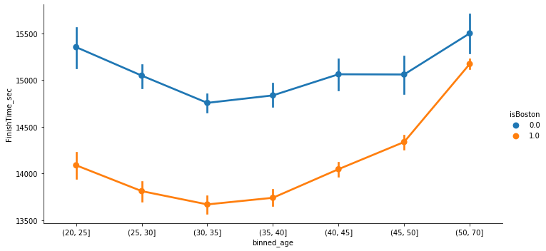
    


Finish time across boston and moscow for binned ages BUT only for males.


```python

```


```python
sns.factorplot(x='binned_age',y='FinishTime_sec',hue='isBoston',data=df_merged_bm[df_merged_bm.Gender == 1.0],aspect=2,kind='point')
```


    <seaborn.axisgrid.FacetGrid at 0x16761da0>


    
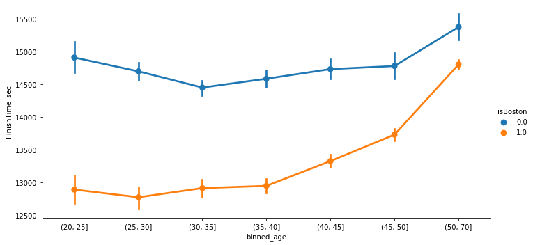
    


Finish time across boston and moscow for binned ages BUT only for females.


```python
sns.factorplot(x='binned_age',y='FinishTime_sec',hue='isBoston',data=df_merged_bm[df_merged_bm.Gender == 0.0],aspect=2,kind='point')
```


    <seaborn.axisgrid.FacetGrid at 0x16e1efd0>


    
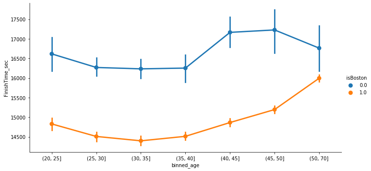
    


# <u> Managerial Insights</u>

<ul>
    <li> It is advisible to younger age athletes to focus on improving the endurance </li>
</ul>

## Decision Tree


```python
df_Boston.head()
```


<div>
 
<table border="1" class="dataframe">
  <thead>
    <tr style="text-align: right;">
      <th></th>
      <th>BibNo</th>
      <th>Name</th>
      <th>Age</th>
      <th>Gender</th>
      <th>City</th>
      <th>State</th>
      <th>Country</th>
      <th>10K</th>
      <th>Half</th>
      <th>40K</th>
      <th>Pace_minpermile</th>
      <th>Finish_Time</th>
      <th>Overall_ranking</th>
      <th>Gender_ranking</th>
      <th>Division_ranking</th>
      <th>Final_10k_sec</th>
      <th>Final_Half_sec</th>
      <th>Final_40k_sec</th>
      <th>FinishTime_sec</th>
      <th>boston_split_ratio</th>
      <th>binned_age1</th>
      <th>binned_age2</th>
    </tr>
  </thead>
  <tbody>
    <tr>
      <th>0</th>
      <td>11</td>
      <td>Kirui, Geoffrey</td>
      <td>24</td>
      <td>1.0</td>
      <td>Keringet</td>
      <td>NaN</td>
      <td>KEN</td>
      <td>0:30:28</td>
      <td>1:04:35</td>
      <td>2:02:53</td>
      <td>0:04:57</td>
      <td>2:09:37</td>
      <td>1</td>
      <td>1</td>
      <td>1</td>
      <td>1828</td>
      <td>3875</td>
      <td>7373</td>
      <td>7777</td>
      <td>1.006968</td>
      <td>(15, 25]</td>
      <td>(20, 25]</td>
    </tr>
    <tr>
      <th>1</th>
      <td>17</td>
      <td>Rupp, Galen</td>
      <td>30</td>
      <td>1.0</td>
      <td>Portland</td>
      <td>OR</td>
      <td>USA</td>
      <td>0:30:27</td>
      <td>1:04:35</td>
      <td>2:03:14</td>
      <td>0:04:58</td>
      <td>2:09:58</td>
      <td>2</td>
      <td>2</td>
      <td>2</td>
      <td>1827</td>
      <td>3875</td>
      <td>7394</td>
      <td>7798</td>
      <td>1.012387</td>
      <td>(25, 35]</td>
      <td>(29, 35]</td>
    </tr>
    <tr>
      <th>2</th>
      <td>23</td>
      <td>Osako, Suguru</td>
      <td>25</td>
      <td>1.0</td>
      <td>Machida-City</td>
      <td>NaN</td>
      <td>JPN</td>
      <td>0:30:29</td>
      <td>1:04:36</td>
      <td>2:03:38</td>
      <td>0:04:59</td>
      <td>2:10:28</td>
      <td>3</td>
      <td>3</td>
      <td>3</td>
      <td>1829</td>
      <td>3876</td>
      <td>7418</td>
      <td>7828</td>
      <td>1.019608</td>
      <td>(15, 25]</td>
      <td>(20, 25]</td>
    </tr>
    <tr>
      <th>3</th>
      <td>21</td>
      <td>Biwott, Shadrack</td>
      <td>32</td>
      <td>1.0</td>
      <td>Mammoth Lakes</td>
      <td>CA</td>
      <td>USA</td>
      <td>0:30:29</td>
      <td>1:04:45</td>
      <td>2:04:35</td>
      <td>0:05:03</td>
      <td>2:12:08</td>
      <td>4</td>
      <td>4</td>
      <td>4</td>
      <td>1829</td>
      <td>3885</td>
      <td>7475</td>
      <td>7928</td>
      <td>1.040669</td>
      <td>(25, 35]</td>
      <td>(29, 35]</td>
    </tr>
    <tr>
      <th>4</th>
      <td>9</td>
      <td>Chebet, Wilson</td>
      <td>31</td>
      <td>1.0</td>
      <td>Marakwet</td>
      <td>NaN</td>
      <td>KEN</td>
      <td>0:30:28</td>
      <td>1:04:35</td>
      <td>2:05:00</td>
      <td>0:05:04</td>
      <td>2:12:35</td>
      <td>5</td>
      <td>5</td>
      <td>5</td>
      <td>1828</td>
      <td>3875</td>
      <td>7500</td>
      <td>7955</td>
      <td>1.052903</td>
      <td>(25, 35]</td>
      <td>(29, 35]</td>
    </tr>
  </tbody>
</table>
</div>


```python
dt = tree.DecisionTreeRegressor(max_depth=2)
```


```python
df_bos_dec_tree = df_Boston.copy()
```


```python
df_bos_dec_tree = pd.get_dummies(data=df_bos_dec_tree,columns=['Country'])
```


```python
X= df_bos_dec_tree.drop(columns=['BibNo','Age','City','State','10K','40K','Pace_minpermile','Name',\
                              'Finish_Time','Overall_ranking','Gender_ranking','boston_split_ratio',\
                                 'Division_ranking','Half','Final_40k_sec','binned_age2',\
                                'binned_age1'],axis=1)
X.head()
X.columns
```


<div>
 
<table border="1" class="dataframe">
  <thead>
    <tr style="text-align: right;">
      <th></th>
      <th>Gender</th>
      <th>Final_10k_sec</th>
      <th>Final_Half_sec</th>
      <th>FinishTime_sec</th>
      <th>Country_ALG</th>
      <th>Country_AND</th>
      <th>Country_ARG</th>
      <th>Country_AUS</th>
      <th>Country_AUT</th>
      <th>Country_BAR</th>
      <th>Country_BDI</th>
      <th>Country_BEL</th>
      <th>Country_BER</th>
      <th>Country_BRA</th>
      <th>Country_BRN</th>
      <th>...</th>
      <th>Country_SRB</th>
      <th>Country_SUI</th>
      <th>Country_SVK</th>
      <th>Country_SWE</th>
      <th>Country_TCA</th>
      <th>Country_THA</th>
      <th>Country_TRI</th>
      <th>Country_TUR</th>
      <th>Country_TWN</th>
      <th>Country_UAE</th>
      <th>Country_UKR</th>
      <th>Country_URU</th>
      <th>Country_USA</th>
      <th>Country_VEN</th>
      <th>Country_ZIM</th>
    </tr>
  </thead>
  <tbody>
    <tr>
      <th>0</th>
      <td>1.0</td>
      <td>1828</td>
      <td>3875</td>
      <td>7777</td>
      <td>0</td>
      <td>0</td>
      <td>0</td>
      <td>0</td>
      <td>0</td>
      <td>0</td>
      <td>0</td>
      <td>0</td>
      <td>0</td>
      <td>0</td>
      <td>0</td>
      <td>...</td>
      <td>0</td>
      <td>0</td>
      <td>0</td>
      <td>0</td>
      <td>0</td>
      <td>0</td>
      <td>0</td>
      <td>0</td>
      <td>0</td>
      <td>0</td>
      <td>0</td>
      <td>0</td>
      <td>0</td>
      <td>0</td>
      <td>0</td>
    </tr>
    <tr>
      <th>1</th>
      <td>1.0</td>
      <td>1827</td>
      <td>3875</td>
      <td>7798</td>
      <td>0</td>
      <td>0</td>
      <td>0</td>
      <td>0</td>
      <td>0</td>
      <td>0</td>
      <td>0</td>
      <td>0</td>
      <td>0</td>
      <td>0</td>
      <td>0</td>
      <td>...</td>
      <td>0</td>
      <td>0</td>
      <td>0</td>
      <td>0</td>
      <td>0</td>
      <td>0</td>
      <td>0</td>
      <td>0</td>
      <td>0</td>
      <td>0</td>
      <td>0</td>
      <td>0</td>
      <td>1</td>
      <td>0</td>
      <td>0</td>
    </tr>
    <tr>
      <th>2</th>
      <td>1.0</td>
      <td>1829</td>
      <td>3876</td>
      <td>7828</td>
      <td>0</td>
      <td>0</td>
      <td>0</td>
      <td>0</td>
      <td>0</td>
      <td>0</td>
      <td>0</td>
      <td>0</td>
      <td>0</td>
      <td>0</td>
      <td>0</td>
      <td>...</td>
      <td>0</td>
      <td>0</td>
      <td>0</td>
      <td>0</td>
      <td>0</td>
      <td>0</td>
      <td>0</td>
      <td>0</td>
      <td>0</td>
      <td>0</td>
      <td>0</td>
      <td>0</td>
      <td>0</td>
      <td>0</td>
      <td>0</td>
    </tr>
    <tr>
      <th>3</th>
      <td>1.0</td>
      <td>1829</td>
      <td>3885</td>
      <td>7928</td>
      <td>0</td>
      <td>0</td>
      <td>0</td>
      <td>0</td>
      <td>0</td>
      <td>0</td>
      <td>0</td>
      <td>0</td>
      <td>0</td>
      <td>0</td>
      <td>0</td>
      <td>...</td>
      <td>0</td>
      <td>0</td>
      <td>0</td>
      <td>0</td>
      <td>0</td>
      <td>0</td>
      <td>0</td>
      <td>0</td>
      <td>0</td>
      <td>0</td>
      <td>0</td>
      <td>0</td>
      <td>1</td>
      <td>0</td>
      <td>0</td>
    </tr>
    <tr>
      <th>4</th>
      <td>1.0</td>
      <td>1828</td>
      <td>3875</td>
      <td>7955</td>
      <td>0</td>
      <td>0</td>
      <td>0</td>
      <td>0</td>
      <td>0</td>
      <td>0</td>
      <td>0</td>
      <td>0</td>
      <td>0</td>
      <td>0</td>
      <td>0</td>
      <td>...</td>
      <td>0</td>
      <td>0</td>
      <td>0</td>
      <td>0</td>
      <td>0</td>
      <td>0</td>
      <td>0</td>
      <td>0</td>
      <td>0</td>
      <td>0</td>
      <td>0</td>
      <td>0</td>
      <td>0</td>
      <td>0</td>
      <td>0</td>
    </tr>
  </tbody>
</table>
<p>5 rows × 95 columns</p>
</div>


    Index(['Gender', 'Final_10k_sec', 'Final_Half_sec', 'FinishTime_sec',
           'Country_ALG', 'Country_AND', 'Country_ARG', 'Country_AUS',
           'Country_AUT', 'Country_BAR', 'Country_BDI', 'Country_BEL',
           'Country_BER', 'Country_BRA', 'Country_BRN', 'Country_BUL',
           'Country_CAN', 'Country_CAY', 'Country_CHI', 'Country_CHN',
           'Country_COL', 'Country_CRC', 'Country_CRO', 'Country_CZE',
           'Country_DEN', 'Country_DOM', 'Country_ECU', 'Country_EGY',
           'Country_ESA', 'Country_ESP', 'Country_EST', 'Country_ETH',
           'Country_FIN', 'Country_FLK', 'Country_FRA', 'Country_GBR',
           'Country_GER', 'Country_GRE', 'Country_GRN', 'Country_GUA',
           'Country_HKG', 'Country_HON', 'Country_HUN', 'Country_INA',
           'Country_IND', 'Country_IRL', 'Country_ISL', 'Country_ISR',
           'Country_ITA', 'Country_JAM', 'Country_JPN', 'Country_KEN',
           'Country_KOR', 'Country_KSA', 'Country_KUW', 'Country_LAT',
           'Country_LTU', 'Country_LUX', 'Country_MAR', 'Country_MAS',
           'Country_MEX', 'Country_MGL', 'Country_MLT', 'Country_NCA',
           'Country_NED', 'Country_NGR', 'Country_NOR', 'Country_NZL',
           'Country_PAN', 'Country_PAR', 'Country_PER', 'Country_PHI',
           'Country_POL', 'Country_POR', 'Country_ROU', 'Country_RSA',
           'Country_RUS', 'Country_SIN', 'Country_SLO', 'Country_SMR',
           'Country_SRB', 'Country_SUI', 'Country_SVK', 'Country_SWE',
           'Country_TCA', 'Country_THA', 'Country_TRI', 'Country_TUR',
           'Country_TWN', 'Country_UAE', 'Country_UKR', 'Country_URU',
           'Country_USA', 'Country_VEN', 'Country_ZIM'],
          dtype='object')


```python
Y=df_bos_dec_tree.Age
```


```python
dt.fit(X,Y)
```


    DecisionTreeRegressor(criterion='mse', max_depth=2, max_features=None,
                          max_leaf_nodes=None, min_impurity_decrease=0.0,
                          min_impurity_split=None, min_samples_leaf=1,
                          min_samples_split=2, min_weight_fraction_leaf=0.0,
                          presort=False, random_state=None, splitter='best')


```python
import os
os.environ["PATH"] += os.pathsep + r'C:\Users\MIH\Anaconda3\Library\bin\graphviz'

```


```python
# This code will visualize a decision tree dt, trained with the attributes in X and the class labels in Y
dt_feature_names = list(X.columns)
dt_target_names = [str(s) for s in Y.unique()]
tree.export_graphviz(dt, out_file='tree.dot', 
    feature_names=dt_feature_names, class_names=dt_target_names,
    filled=True)  
graph = pydotplus.graph_from_dot_file('tree.dot')
Image(graph.create_png())
```


    
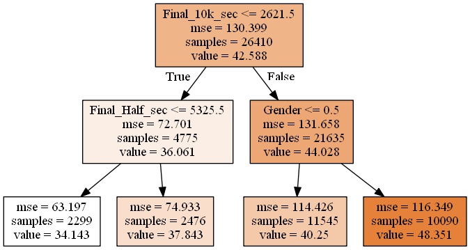
    


## LassoRegressor


```python
from sklearn import linear_model
regLasso = linear_model.Lasso()
```


```python
regLasso.fit(X,Y)
```


    Lasso(alpha=1.0, copy_X=True, fit_intercept=True, max_iter=1000,
          normalize=False, positive=False, precompute=False, random_state=None,
          selection='cyclic', tol=0.0001, warm_start=False)


```python
regLasso.coef_
```


    array([ 2.45946604e+00,  1.54926501e-03,  6.73233896e-04,  5.91283677e-04,
            0.00000000e+00,  0.00000000e+00,  0.00000000e+00,  0.00000000e+00,
            0.00000000e+00,  0.00000000e+00, -0.00000000e+00,  0.00000000e+00,
            0.00000000e+00,  0.00000000e+00, -0.00000000e+00,  0.00000000e+00,
            0.00000000e+00, -0.00000000e+00,  0.00000000e+00,  0.00000000e+00,
            0.00000000e+00, -0.00000000e+00,  0.00000000e+00,  0.00000000e+00,
            0.00000000e+00,  0.00000000e+00,  0.00000000e+00, -0.00000000e+00,
            0.00000000e+00,  0.00000000e+00,  0.00000000e+00, -0.00000000e+00,
            0.00000000e+00, -0.00000000e+00,  0.00000000e+00,  0.00000000e+00,
            0.00000000e+00,  0.00000000e+00,  0.00000000e+00,  0.00000000e+00,
            0.00000000e+00, -0.00000000e+00,  0.00000000e+00, -0.00000000e+00,
            0.00000000e+00, -0.00000000e+00,  0.00000000e+00,  0.00000000e+00,
            0.00000000e+00,  0.00000000e+00,  0.00000000e+00, -0.00000000e+00,
            0.00000000e+00,  0.00000000e+00, -0.00000000e+00, -0.00000000e+00,
           -0.00000000e+00,  0.00000000e+00,  0.00000000e+00,  0.00000000e+00,
            0.00000000e+00,  0.00000000e+00, -0.00000000e+00, -0.00000000e+00,
            0.00000000e+00, -0.00000000e+00,  0.00000000e+00,  0.00000000e+00,
            0.00000000e+00,  0.00000000e+00,  0.00000000e+00,  0.00000000e+00,
            0.00000000e+00,  0.00000000e+00,  0.00000000e+00,  0.00000000e+00,
           -0.00000000e+00,  0.00000000e+00,  0.00000000e+00, -0.00000000e+00,
           -0.00000000e+00,  0.00000000e+00,  0.00000000e+00,  0.00000000e+00,
            0.00000000e+00,  0.00000000e+00,  0.00000000e+00,  0.00000000e+00,
            0.00000000e+00,  0.00000000e+00, -0.00000000e+00,  0.00000000e+00,
           -0.00000000e+00,  0.00000000e+00, -0.00000000e+00])


## KMeans Clustering


```python
from sklearn.cluster import KMeans
```


```python
clu = KMeans(n_clusters=2, random_state=0)
```


```python
clu
```


    KMeans(algorithm='auto', copy_x=True, init='k-means++', max_iter=300,
           n_clusters=2, n_init=10, n_jobs=None, precompute_distances='auto',
           random_state=0, tol=0.0001, verbose=0)


```python
clu.fit(X)
```


    KMeans(algorithm='auto', copy_x=True, init='k-means++', max_iter=300,
           n_clusters=2, n_init=10, n_jobs=None, precompute_distances='auto',
           random_state=0, tol=0.0001, verbose=0)


```python
clu.labels_
```


    array([1, 1, 1, ..., 0, 0, 0])


```python
df2 = X.copy()
```


```python
df2['cluster']=clu.labels_
```


```python
df2.groupby('cluster').mean()
```


<div>
 
<table border="1" class="dataframe">
  <thead>
    <tr style="text-align: right;">
      <th></th>
      <th>Gender</th>
      <th>Final_10k_sec</th>
      <th>Final_Half_sec</th>
      <th>FinishTime_sec</th>
      <th>Country_ALG</th>
      <th>Country_AND</th>
      <th>Country_ARG</th>
      <th>Country_AUS</th>
      <th>Country_AUT</th>
      <th>Country_BAR</th>
      <th>Country_BDI</th>
      <th>Country_BEL</th>
      <th>Country_BER</th>
      <th>Country_BRA</th>
      <th>Country_BRN</th>
      <th>...</th>
      <th>Country_SRB</th>
      <th>Country_SUI</th>
      <th>Country_SVK</th>
      <th>Country_SWE</th>
      <th>Country_TCA</th>
      <th>Country_THA</th>
      <th>Country_TRI</th>
      <th>Country_TUR</th>
      <th>Country_TWN</th>
      <th>Country_UAE</th>
      <th>Country_UKR</th>
      <th>Country_URU</th>
      <th>Country_USA</th>
      <th>Country_VEN</th>
      <th>Country_ZIM</th>
    </tr>
    <tr>
      <th>cluster</th>
      <th></th>
      <th></th>
      <th></th>
      <th></th>
      <th></th>
      <th></th>
      <th></th>
      <th></th>
      <th></th>
      <th></th>
      <th></th>
      <th></th>
      <th></th>
      <th></th>
      <th></th>
      <th></th>
      <th></th>
      <th></th>
      <th></th>
      <th></th>
      <th></th>
      <th></th>
      <th></th>
      <th></th>
      <th></th>
      <th></th>
      <th></th>
      <th></th>
      <th></th>
      <th></th>
      <th></th>
    </tr>
  </thead>
  <tbody>
    <tr>
      <th>0</th>
      <td>0.432154</td>
      <td>3581.235880</td>
      <td>7843.994727</td>
      <td>17233.904031</td>
      <td>0.000000</td>
      <td>0.000000</td>
      <td>0.000586</td>
      <td>0.004921</td>
      <td>0.001055</td>
      <td>0.000000</td>
      <td>0.000000</td>
      <td>0.001758</td>
      <td>0.000117</td>
      <td>0.004570</td>
      <td>0.000000</td>
      <td>...</td>
      <td>0.000000</td>
      <td>0.003984</td>
      <td>0.000234</td>
      <td>0.001875</td>
      <td>0.000000</td>
      <td>0.000234</td>
      <td>0.000000</td>
      <td>0.000117</td>
      <td>0.000937</td>
      <td>0.000234</td>
      <td>0.000234</td>
      <td>0.000469</td>
      <td>0.825521</td>
      <td>0.000000</td>
      <td>0.000000</td>
    </tr>
    <tr>
      <th>1</th>
      <td>0.601365</td>
      <td>2821.851253</td>
      <td>6044.298221</td>
      <td>12875.059297</td>
      <td>0.000112</td>
      <td>0.000056</td>
      <td>0.001734</td>
      <td>0.008335</td>
      <td>0.000727</td>
      <td>0.000224</td>
      <td>0.000056</td>
      <td>0.001510</td>
      <td>0.000112</td>
      <td>0.009286</td>
      <td>0.000056</td>
      <td>...</td>
      <td>0.000056</td>
      <td>0.003524</td>
      <td>0.000224</td>
      <td>0.002517</td>
      <td>0.000056</td>
      <td>0.000168</td>
      <td>0.000056</td>
      <td>0.000224</td>
      <td>0.002573</td>
      <td>0.000280</td>
      <td>0.000112</td>
      <td>0.000056</td>
      <td>0.777579</td>
      <td>0.000336</td>
      <td>0.000056</td>
    </tr>
  </tbody>
</table>
<p>2 rows × 95 columns</p>
</div>


```python

```

